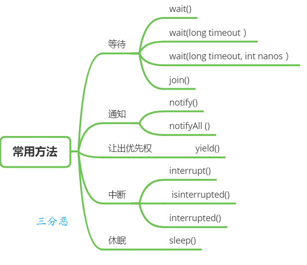

## 并行跟并发有什么区别？
- 并行是指多个处理器同时执行多个任务，每个核心实际上可以在同一时间独立地执行不同的任务。
- 并发是指系统有处理多个任务的能力，但是任意时刻只有一个任务在执行。在单核处理器上，多个任务是通过时间片轮转的方式实现的。但这种切换非常快，给人感觉是在同时执行。

## 你对线程安全的理解是什么？
线程安全是并发编程中一个重要的概念，如果一段代码块或者一个方法在多线程环境中被多个线程同时执行时能够正确地处理共享数据，那么这段代码块或者方法就是线程安全的。

可以从三个要素来确保线程安全：

①、原子性：确保当某个线程修改共享变量时，没有其他线程可以同时修改这个变量，即这个操作是不可分割的。
原子性可以通过互斥锁（如 synchronized）或原子操作（如 AtomicInteger 类中的方法）来保证。

②、可见性：确保一个线程对共享变量的修改可以立即被其他线程看到。
volatile 关键字可以保证了变量的修改对所有线程立即可见，并防止编译器优化导致的可见性问题。

③、活跃性问题：要确保线程不会因为死锁、饥饿、活锁等问题导致无法继续执行。

## 说说什么是进程和线程？
进程说简单点就是我们在电脑上启动的一个个应用，比如我们启动一个浏览器，就会启动了一个浏览器进程。进程是操作系统资源分配的最小单位，它包括了程序、数据和进程控制块等。

线程说简单点就是我们在 Java 程序中启动的一个 main 线程，一个进程至少会有一个线程。当然了，我们也可以启动多个线程，比如说一个线程进行 IO 读写，一个线程进行加减乘除计算，这样就可以充分发挥多核 CPU 的优势，因为 IO 读写相对 CPU 计算来说慢得多。线程是 CPU 分配资源的基本单位。


一个进程中可以有多个线程，多个线程共用进程的堆和方法区（Java 虚拟机规范中的一个定义，JDK 8 以后的实现为元空间）资源，但是每个线程都会有自己的程序计数器和栈。

## 如何理解协程？
协程通常被视为比线程更轻量级的并发单元，它们主要在一些支持异步编程模型的语言中得到了原生支持，如 Kotlin、Go 等。

```java
class CompletableFutureExample {
    public static void main(String[] args) throws ExecutionException, InterruptedException {
        // 异步执行任务1
        CompletableFuture<Integer> future1 = CompletableFuture.supplyAsync(() -> {
            try {
                Thread.sleep(1000); // 模拟耗时操作
            } catch (InterruptedException e) {
                e.printStackTrace();
            }
            return 10;
        });

        // 异步执行任务2
        CompletableFuture<Integer> future2 = CompletableFuture.supplyAsync(() -> {
            try {
                Thread.sleep(1000); // 模拟耗时操作
            } catch (InterruptedException e) {
                e.printStackTrace();
            }
            return 20;
        });

        // 合并两个任务的结果并计算
        CompletableFuture<Integer> resultFuture = future1.thenCombine(future2, Integer::sum);

        // 等待最终结果并打印
        System.out.println("结果: " + resultFuture.get());
    }
}
```

## 说说线程的共享内存？
线程之间想要进行通信，可以通过消息传递和共享内存两种方法来完成。那 Java 采用的是共享内存的并发模型。

这个模型被称为 Java 内存模型，也就是 JMM，JMM 决定了一个线程对共享变量的写入何时对另外一个线程可见。

线程之间的共享变量存储在主内存（main memory）中，每个线程都有一个私有的本地内存（local memory），本地内存中存储了共享变量的副本。当然了，本地内存是 JMM 的一个抽象概念，并不真实存在。

线程 A 与线程 B 之间如要通信的话，必须要经历下面 2 个步骤：
- 线程 A 把本地内存 A 中的共享变量副本刷新到主内存中。
- 线程 B 到主内存中读取线程 A 刷新过的共享变量，再同步到自己的共享变量副本中。


## 线程有几种创建方式？
Java 中创建线程主要有三种方式，分别为继承 Thread 类、实现 Runnable 接口、实现 Callable 接口。

1. 继承 Thread 类，重写 run()方法，调用 start()方法启动线程。
```java
class ThreadTask extends Thread {
    public void run() {
        System.out.println("看完二哥的 Java 进阶之路，上岸了!");
    }

    public static void main(String[] args) {
        ThreadTask task = new ThreadTask();
        task.start();
    }
}
```
这种方法的缺点是，由于 Java 不支持多重继承，所以如果类已经继承了另一个类，就不能使用这种方法了。    

2. 实现 Runnable 接口，重写 run() 方法，然后创建 Thread 对象，将 Runnable 对象作为参数传递给 Thread 对象，调用 start() 方法启动线程。
```java
class RunnableTask implements Runnable {
    public void run() {
        System.out.println("看完二哥的 Java 进阶之路，上岸了!");
    }

    public static void main(String[] args) {
        RunnableTask task = new RunnableTask();
        Thread thread = new Thread(task);
        thread.start();
    }
}
```
这种方法的优点是可以避免 Java 的单继承限制，并且更符合面向对象的编程思想，因为 Runnable 接口将任务代码和线程控制的代码解耦了。

3. 实现 Callable 接口，重写 call() 方法，然后创建 FutureTask 对象，参数为 Callable 对象；紧接着创建 Thread 对象，参数为 FutureTask 对象，调用 start() 方法启动线程。
```java
class CallableTask implements Callable<String> {
    public String call() {
        return "看完二哥的 Java 进阶之路，上岸了!";
    }

    public static void main(String[] args) throws ExecutionException, InterruptedException {
        CallableTask task = new CallableTask();
        FutureTask<String> futureTask = new FutureTask<>(task);
        Thread thread = new Thread(futureTask);
        thread.start();
        System.out.println(futureTask.get());
    }
}
```
这种方法的优点是可以获取线程的执行结果。

## 一个 8G 内存的系统最多能创建多少线程?
在确定一个系统最多可以创建多个线程时，除了需要考虑系统的内存大小外，Java 虚拟机栈的大小也是值得考虑的因素。

线程在创建的时候会被分配一个虚拟机栈，在 64 位操作系统中，默认大小为 1M。

通过 java -XX:+PrintFlagsFinal -version | grep ThreadStackSize 这个命令可以查看 JVM 栈的默认大小。

换句话说，8GB = 8 _ 1024 MB = 8 _ 1024 _ 1024 KB，所以一个 8G 内存的系统可以创建的线程数为 8 _ 1024 = 8192 个。

但操作系统本身的运行也需要消耗一定的内存，所以实际上可以创建的线程数肯定会比 8192 少一些。

## 启动一个 Java 程序，你能说说里面有哪些线程吗？
首先是 main 线程，这是程序开始执行的入口。

然后是垃圾回收线程，它是一个后台线程，负责回收不再使用的对象。

还有编译器线程，在及时编译中（JIT），负责把一部分热点代码编译后放到 codeCache 中，以提升程序的执行效率。

- Thread: main (ID=1) - 主线程，Java 程序启动时由 JVM 创建。
- Thread: Reference Handler (ID=2) - 这个线程是用来处理引用对象的，如软引用（SoftReference）、弱引用（WeakReference）和虚引用（PhantomReference）。负责清理被 JVM 回收的对象。
- Thread: Finalizer (ID=3) - 终结器线程，负责调用对象的 finalize 方法。对象在垃圾回收器标记为可回收之前，由该线程执行其 finalize 方法，用于执行特定的资源释放操作。
- Thread: Signal Dispatcher (ID=4) - 信号调度线程，处理来自操作系统的信号，将它们转发给 JVM 进行进一步处理，例如响应中断、停止等信号。
- Thread: Monitor Ctrl-Break (ID=5) - 监视器线程，通常由一些特定的 IDE 创建，用于在开发过程中监控和管理程序执行或者处理中断。


## 调用 start()方法时会执行 run()方法，那怎么不直接调用 run()方法？

在 Java 中，启动一个新的线程应该调用其start()方法，而不是直接调用run()方法。

当调用start()方法时，会启动一个新的线程，并让这个新线程调用run()方法。这样，run()方法就在新的线程中运行，从而实现多线程并发。

如果直接调用run()方法，那么run()方法就在当前线程中运行，没有新的线程被创建，也就没有实现多线程的效果。

## 线程有哪些常用的调度方法？


### 线程等待
在 Object 类中有一些方法可以用于线程的等待与通知。

①、wait()：当一个线程 A 调用一个共享变量的 wait() 方法时，线程 A 会被阻塞挂起，直到发生下面几种情况才会返回：

线程 B 调用了共享对象 notify()或者 notifyAll() 方法；
其他线程调用了线程 A 的 interrupt() 方法，线程 A 抛出 InterruptedException 异常返回。

②、wait(long timeout) ：这个方法相比 wait() 方法多了一个超时参数，它的不同之处在于，如果线程 A 调用共享对象的 wait(long timeout)方法后，没有在指定的 timeout 时间内被其它线程唤醒，那么这个方法还是会因为超时而返回。

③、wait(long timeout, int nanos)，其内部调用的是 wait(long timout) 方法。

### 线程唤醒
唤醒线程主要有下面两个方法：

①、notify()：一个线程 A 调用共享对象的 notify() 方法后，会唤醒一个在这个共享变量上调用 wait 系列方法后被挂起的线程。

一个共享变量上可能会有多个线程在等待，具体唤醒哪个等待的线程是随机的。

②、notifyAll()：不同于在共享变量上调用 notify() 方法会唤醒被阻塞到该共享变量上的一个线程，notifyAll 方法会唤醒所有在该共享变量上调用 wait 系列方法而被挂起的线程。

Thread 类还提供了一个 join() 方法，意思是如果一个线程 A 执行了 thread.join()，当前线程 A 会等待 thread 线程终止之后才从 thread.join() 返回。

### 线程休眠
sleep(long millis)：Thread 类中的静态方法，当一个执行中的线程 A 调用了 Thread 的 sleep 方法后，线程 A 会暂时让出指定时间的执行权。

但是线程 A 所拥有的监视器资源，比如锁，还是持有不让出的。指定的睡眠时间到了后该方法会正常返回，接着参与 CPU 的调度，获取到 CPU 资源后就可以继续运行。

### 让出优先权
yield()：Thread 类中的静态方法，当一个线程调用 yield 方法时，实际是在暗示线程调度器，当前线程请求让出自己的 CPU，但是线程调度器可能会“装看不见”忽略这个暗示。

### 线程中断
Java 中的线程中断是一种线程间的协作模式，通过设置线程的中断标志并不能直接终止该线程的执行。被中断的线程会根据中断状态自行处理。

- void interrupt() 方法：中断线程，例如，当线程 A 运行时，线程 B 可以调用线程 interrupt() 方法来设置线程的中断标志为 true 并立即返回。设置标志仅仅是设置标志, 线程 B 实际并没有被中断，会继续往下执行。
- boolean isInterrupted() 方法： 检测当前线程是否被中断。
- boolean interrupted() 方法： 检测当前线程是否被中断，与 isInterrupted 不同的是，该方法如果发现当前线程被中断，则会清除中断标志。

为了响应中断，线程的执行代码应该这样编写：

```java
public void run() {
    try {
        while (!Thread.currentThread().isInterrupted()) {
            // 执行任务
        }
    } catch (InterruptedException e) {
        // 线程被中断时的清理代码
    } finally {
        // 线程结束前的清理代码
    }
}
```
stop 方法用来强制线程停止执行，目前已经处于废弃状态，因为 stop 方法会导致线程立即停止，可能会在不一致的状态下释放锁，破坏对象的一致性，导致难以发现的错误和资源泄漏。

## 线程有几种状态？


## 什么是线程上下文切换？
使用多线程的目的是为了充分利用 CPU，但是我们知道，并发其实是一个 CPU 来应付多个线程。

为了让用户感觉多个线程是在同时执行的， CPU 资源的分配采用了时间片轮转也就是给每个线程分配一个时间片，线程在时间片内占用 CPU 执行任务。当线程使用完时间片后，就会处于就绪状态并让出 CPU 让其他线程占用，这就是上下文切换。


### 线程可以被多核调度吗？
当然可以，在现代操作系统和多核处理器的环境中，线程的调度和管理是操作系统内核的重要职责之一。

操作系统的调度器负责将线程分配给可用的 CPU 核心，从而实现并行处理。

多核处理器提供了并行执行多个线程的能力。每个核心可以独立执行一个或多个线程，操作系统的任务调度器会根据策略和算法，如优先级调度、轮转调度等，决定哪个线程何时在哪个核心上运行。

## 守护线程了解吗？
Java 中的线程分为两类，分别为 daemon 线程（守护线程）和 user 线程（用户线程）。

在 JVM 启动时会调用 main 方法，main 方法所在的线程就是一个用户线程。其实在 JVM 内部同时还启动了很多守护线程， 比如垃圾回收线程。

那么守护线程和用户线程有什么区别呢？区别之一是当最后一个非守护线程束时， JVM 会正常退出，而不管当前是否存在守护线程，也就是说守护线程是否结束并不影响 JVM 退出。换而言之，只要有一个用户线程还没结束，正常情况下 JVM 就不会退出。


## 线程间有哪些通信方式？
线程之间传递信息有多种方式，每种方式适用于不同的场景。比如说使用共享对象、wait() 和 notify()、Exchanger 和 CompletableFuture。

①、使用共享对象，多个线程可以访问和修改同一个对象，从而实现信息的传递，比如说 volatile 和 synchronized 关键字。

②、使用 wait() 和 notify()，例如，生产者-消费者模式中，生产者生产数据，消费者消费数据，通过 wait() 和 notify() 方法可以实现生产和消费的协调。

一个线程调用共享对象的 wait() 方法时，它会进入该对象的等待池，并释放已经持有的该对象的锁，进入等待状态，直到其他线程调用相同对象的 notify() 或 notifyAll() 方法。

一个线程调用共享对象的 notify() 方法时，它会唤醒在该对象等待池中等待的一个线程，使其进入锁池，等待获取锁。

Condition 也提供了类似的方法，await() 负责等待、signal() 和 signalAll() 负责通知。

通常与锁（特别是 ReentrantLock）一起使用，为线程提供了一种等待某个条件成真的机制，并允许其他线程在该条件变化时通知等待线程。更灵活、更强大。

```java
class MessageBox {
    private String message;
    private boolean empty = true;

    public synchronized void produce(String message) {
        while (!empty) {
            try {
                wait();
            } catch (InterruptedException e) {
                Thread.currentThread().interrupt();
            }
        }
        empty = false;
        this.message = message;
        notifyAll();
    }

    public synchronized String consume() {
        while (empty) {
            try {
                wait();
            } catch (InterruptedException e) {
                Thread.currentThread().interrupt();
            }
        }
        empty = true;
        notifyAll();
        return message;
    }
}

public class Main {
    public static void main(String[] args) {
        MessageBox box = new MessageBox();

        Thread producer = new Thread(() -> {
            box.produce("Message from producer");
        });

        Thread consumer = new Thread(() -> {
            String message = box.consume();
            System.out.println("Consumer received: " + message);
        });

        producer.start();
        consumer.start();
    }
}
```


③、使用 Exchanger，Exchanger 是一个同步点，可以在两个线程之间交换数据。一个线程调用 exchange() 方法，将数据传递给另一个线程，同时接收另一个线程的数据。
```java
import java.util.concurrent.Exchanger;

public class Main {
    public static void main(String[] args) {
        Exchanger<String> exchanger = new Exchanger<>();

        Thread thread1 = new Thread(() -> {
            try {
                String message = "Message from thread1";
                String response = exchanger.exchange(message);
                System.out.println("Thread1 received: " + response);
            } catch (InterruptedException e) {
                Thread.currentThread().interrupt();
            }
        });

        Thread thread2 = new Thread(() -> {
            try {
                String message = "Message from thread2";
                String response = exchanger.exchange(message);
                System.out.println("Thread2 received: " + response);
            } catch (InterruptedException e) {
                Thread.currentThread().interrupt();
            }
        });

        thread1.start();
        thread2.start();
    }
}
```

④、使用 CompletableFuture，CompletableFuture 是 Java 8 引入的一个类，支持异步编程，允许线程在完成计算后将结果传递给其他线程。
```java
public class Main {
    public static void main(String[] args) {
        CompletableFuture<String> future = CompletableFuture.supplyAsync(() -> {
            // 模拟长时间计算
            return "Message from CompletableFuture";
        });

        future.thenAccept(message -> {
            System.out.println("Received: " + message);
        });
    }
}
```

## 请说说 sleep 和 wait 的区别？（补充）
sleep() 和 wait() 是 Java 中用于暂停当前线程的两个重要方法，sleep 是让当前线程休眠，不涉及对象类，也不需要获取对象的锁，属于 Thread 类的方法；wait 是让获得对象锁的线程实现等待，前提要获得对象的锁，属于 Object 类的方法。

它们之间的区别主要有以下几点：

①、所属类不同
- sleep() 方法专属于 Thread 类。
- wait() 方法专属于 Object 类。  

②、锁行为不同  
当线程执行 sleep 方法时，它不会释放任何锁。也就是说，如果一个线程在持有某个对象的锁时调用了 sleep，它在睡眠期间仍然会持有这个锁。

③、使用条件不同
- sleep() 方法可以在任何地方被调用。
- wait() 方法必须在同步代码块或同步方法中被调用，这是因为调
用 wait() 方法的前提是当前线程必须持有对象的锁。否则会抛出 IllegalMonitorStateException 异常。

④、唤醒方式不同  
- 调用 sleep 方法后，线程会进入 TIMED_WAITING 状态（定时等待状态），即在指定的时间内暂停执行。当指定的时间结束后，线程会自动恢复到 RUNNABLE 状态（就绪状态），等待 CPU 调度再次执行。
- 调用 wait 方法后，线程会进入 WAITING 状态（无限期等待状态），直到有其他线程在同一对象上调用 notify 或 notifyAll，线程才会从 WAITING 状态转变为 RUNNABLE 状态，准备再次获得 CPU 的执行权。

⑤、抛出异常不同
- sleep() 方法在等待期间，如果线程被中断，会抛出 InterruptedException。
- 如果线程被中断或等待时间到期时，wait() 方法同样会在等待期间抛出 InterruptedException。

```java
class SleepExample {
    public static void main(String[] args) {
        Thread thread = new Thread(() -> {
            System.out.println("线程准备休眠 2 秒");
            try {
                Thread.sleep(2000); // 线程将睡眠2秒
            } catch (InterruptedException e) {
                e.printStackTrace();
            }
            System.out.println("线程醒来了");
        });

        thread.start();
    }
}
```

```java
class WaitExample {
    public static void main(String[] args) {
        final Object lock = new Object();

        Thread thread = new Thread(() -> {
            synchronized (lock) {
                try {
                    System.out.println("线程准备等待 2 秒");
                    lock.wait(2000); // 线程会等待2秒，或者直到其他线程调用 lock.notify()/notifyAll()
                    System.out.println("线程结束等待");
                } catch (InterruptedException e) {
                    e.printStackTrace();
                }
            }
        });

        thread.start();
    }
}
```

## 线程安全，说一个使用场景？（补充）
线程安全是 Java 并发编程中一个非常重要的概念，它指的是多线程环境下，多个线程对共享资源的访问不会导致数据的不一致性。

一个常见的使用场景是在实现单例模式时确保线程安全。

单例模式确保一个类只有一个实例，并提供一个全局访问点。在多线程环境下，如果多个线程同时尝试创建实例，单例类必须确保只创建一个实例。

饿汉式是一种比较直接的实现方式，它通过在类加载时就立即初始化单例对象来保证线程安全。

```java
public class LazySingleton {
    private static volatile LazySingleton instance;

    private LazySingleton() {}

    public static LazySingleton getInstance() {
        if (instance == null) { // 第一次检查
            synchronized (LazySingleton.class) {
                if (instance == null) { // 第二次检查
                    instance = new LazySingleton();
                }
            }
        }
        return instance;
    }
}
```

## 说一下你对 Java 内存模型的理解？
Java 内存模型（Java Memory Model）是一种抽象的模型，简称 JMM，主要用来定义多线程中变量的访问规则，用来解决变量的可见性、有序性和原子性问题，确保在并发环境中安全地访问共享变量。


JMM 定义了线程内存和主内存之间的抽象关系：线程之间的共享变量存储在主内存（Main Memory）中，每个线程都有一个私有的本地内存（Local Memory），本地内存中存储了共享变量的副本，用来进行线程内部的读写操作。

当一个线程更改了本地内存中共享变量的副本后，它需要将这些更改刷新到主内存中，以确保其他线程可以看到这些更改。
当一个线程需要读取共享变量时，它可能首先从本地内存中读取。如果本地内存中的副本是过时的，线程将从主内存中重新加载共享变量的最新值到本地内存中。
本地内存是 JMM 中的一个抽象概念，并不真实存在。实际上，本地内存可能对应于 CPU 缓存、寄存器或者其他硬件和编译器优化。


对于一个双核 CPU 的系统架构，每个核都有自己的控制器和运算器，其中控制器包含一组寄存器和操作控制器，运算器执行算术逻辅运算。

每个核都有自己的一级缓存，在有些架构里面还有一个所有 CPU 共享的二级缓存。

Java 内存模型里面的本地内存，可能对应的是 L1 缓存或者 L2 缓存或者 CPU 寄存器。

### 为什么线程要用自己的内存？

1. 在多线程环境中，如果所有线程都直接操作主内存中的共享变量，会引发更多的内存访问竞争，这不仅影响性能，还增加了线程安全问题的复杂度。通过让每个线程使用本地内存，可以减少对主内存的直接访问和竞争，从而提高程序的并发性能。

2. 现代 CPU 为了优化执行效率，可能会对指令进行乱序执行（指令重排序）。使用本地内存（CPU 缓存和寄存器）可以在不影响最终执行结果的前提下，使得 CPU 有更大的自由度来乱序执行指令，从而提高执行效率。

## 说你对原子性、可见性、有序性的理解？
- 原子性：指的是一个操作是不可分割的，要么全部执行成功，要么完全不执行。
- 可见性：指的是一个线程对共享变量的修改，能够被其他线程及时看见。
- 有序性：指的是程序代码的执行顺序与代码中的顺序一致。在没有同步机制的情况下，编译器可能会对指令进行重排序，以优化性能。这种重排序可能会导致多线程的执行结果与预期不符。

### 分析下面几行代码的原子性？
```java
int i = 2;
int j = i;
i++;
i = i + 1;
```
- 第 1 句是基本类型赋值，是原子性操作。
- 第 2 句先读 i 的值，再赋值到 j，两步操作，不能保证原子性。
- 第 3 和第 4 句其实是等效的，先读取 i 的值，再+1，最后赋值到 i，三步操作了，不能保证原子性。


## 原子性、可见性、有序性都应该怎么保证呢？
- 原子性：JMM 只能保证基本的原子性，如果要保证一个代码块的原子性，需要使用synchronized 。
- 可见性：Java 是利用volatile关键字来保证可见性的，除此之外，final和synchronized也能保证可见性。
- 有序性：synchronized或者volatile都可以保证多线程之间操作的有序性。


## i++是原子操作吗？
i++ 不是一个原子操作，它包括三个步骤：
- 从内存中读取 i 的值。
- 对 i 进行加 1 操作。
- 将新的值写入内存。

可以使用 synchronized 或 AtomicInteger 确保操作的原子性。

## 说说什么是指令重排？

在执行程序时，为了提高性能，编译器和处理器常常会对指令做重排序。重排序分 3 种类型。

- 编译器优化的重排序。编译器在不改变单线程程序语义的前提下，可以重新安排语句的执行顺序。
- 指令级并行的重排序。现代处理器采用了指令级并行技术（Instruction-Level Parallelism，ILP）来将多条指令重叠执行。如果不存在数据依赖性，处理器可以改变语句对应 机器指令的执行顺序。
- 内存系统的重排序。由于处理器使用缓存和读/写缓冲区，这使得加载和存储操作看上去可能是在乱序执行。

JMM 属于语言级的内存模型，它确保在不同的编译器和不同的处理器平台之上，通过禁止特定类型的编译器重排序和处理器重排序，为程序员提供一致的内存可见性保证。


## volatile 实现原理了解吗？

volatile 关键字主要有两个作用，一个是保证变量的内存可见性，一个是禁止指令重排序。

### volatile 怎么保证可见性的呢？
当一个变量被声明为 volatile 时，Java 内存模型会确保所有线程看到该变量时的值是一致的。

也就是说，当线程对 volatile 变量进行写操作时，JMM 会在写入这个变量之后插入一个 Store-Barrier（写屏障）指令，这个指令会强制将本地内存中的变量值刷新到主内存中。

当线程对 volatile 变量进行读操作时，JMM 会插入一个 Load-Barrier（读屏障）指令，这个指令会强制让本地内存中的变量值失效，从而重新从主内存中读取最新的值。

### volatile 怎么保证有序性的呢？
在程序执行期间，为了提高性能，编译器和处理器会对指令进行重排序。但涉及到 volatile 变量时，它们必须遵循一定的规则：

- 写 volatile 变量的操作之前的操作不会被编译器重排序到写操作之后。
- 读 volatile 变量的操作之后的操作不会被编译器重排序到读操作之前。
这意味着 volatile 变量的写操作总是发生在任何后续读操作之前。

### volatile 和 synchronized 的区别
volatile 关键字用于修饰变量，确保该变量的更新操作对所有线程是可见的，即一旦某个线程修改了 volatile 变量，其他线程会立即看到最新的值。

synchronized 关键字用于修饰方法或代码块，确保同一时刻只有一个线程能够执行该方法或代码块，从而实现互斥访问。


### volatile 加在基本类型和对象上的区别？
当 volatile 用于基本数据类型时，能确保该变量的读写操作是直接从主内存中读取或写入的。
```java
private volatile int count = 0;
```
当 volatile 用于引用类型时，它确保引用本身的可见性，即确保引用指向的对象地址是最新的。
```java
private volatile SomeObject obj = new SomeObject();
```
但是，volatile 并不能保证引用对象内部状态的线程安全性。   
虽然 volatile 确保了 obj 引用的可见性，但对 obj 引用的具体对象的操作并不受 volatile 保护。如果需要保证引用对象内部状态的线程安全，需要使用其他同步机制（如 synchronized 或 ReentrantLock）。


## synchronized 用过吗？怎么使用？
在 Java 中，synchronized 是最常用的锁，它使用简单，并且可以保证线程安全，避免多线程并发访问时出现数据不一致的情况。

随着 JDK 版本的进化，synchronized 的性能也得到了进一步的提升，不再像以前样重量级了。

①、修饰方法
```java
public synchronized void increment() {
    this.count++;
}
```
当在方法声明中使用了 synchronized 关键字，就表示该方法是同步的，也就是说，线程在执行这个方法的时候，其他线程不能同时执行，需要等待锁释放。

如果是静态方法的话，锁的是这个类的 Class 对象，因为静态方法是属于类级别的。
```java
public static synchronized void increment() {
    count++;
}
```

②、修饰代码块
```java
public void increment() {
    synchronized (this) {
        this.count++;
    }
}
```
同步代码块可以减少需要同步的代码量，颗粒度更低，更灵活。synchronized 后面的括号中指定了要锁定的对象，可以是 this，也可以是其他对象。

## synchronized 的实现原理？
### synchronized 是怎么加锁的呢？
synchronized 是 JVM 帮我们实现的，因此在使用的时候不用手动去 lock 和 unlock，JVM 会帮我们自动加锁和解锁。

①、synchronized 修饰代码块时，JVM 会通过 monitorenter、monitorexit 两个指令来实现同步：
- monitorenter 指向同步代码块的开始位置
- monitorexit 指向同步代码块的结束位置。

②、synchronized 修饰方法时，JVM 会通过 ACC_SYNCHRONIZED 标记符来实现同步。

## synchronized 锁住的是什么呢？

monitorenter、monitorexit 或者 ACC_SYNCHRONIZED 都是基于 Monitor 实现的。

实例对象结构里有对象头，对象头里面有一块结构叫 Mark Word，Mark Word 指针指向了monitor。

所谓的 Monitor 其实是一种同步工具，也可以说是一种同步机制。在 Java 虚拟机（HotSpot）中，Monitor 是由ObjectMonitor 实现的，可以叫做内部锁，或者 Monitor 锁。

ObjectMonitor 的工作原理：

ObjectMonitor 有两个队列：_WaitSet、_EntryList，用来保存 ObjectWaiter 对象列表。
_owner，获取 Monitor 对象的线程进入 _owner 区时， _count + 1。如果线程调用了 wait() 方法，此时会释放 Monitor 对象， _owner 恢复为空， _count - 1。同时该等待线程进入 _WaitSet 中，等待被唤醒。


monitorenter，在判断拥有同步标识 ACC_SYNCHRONIZED 抢先进入此方法的线程会优先拥有 Monitor 的 owner ，此时计数器 +1。   
monitorexit，当执行完退出后，计数器 -1，归 0 后被其他进入的线程获得。

### 会不会牵扯到 os 层面呢？  
会，synchronized 升级为重量级锁时，依赖于操作系统的互斥量（mutex）来实现，mutex 用于保证任何给定时间内，只有一个线程可以执行某一段特定的代码段。


## 除了原子性，synchronized 可见性，有序性，可重入性怎么实现？
### synchronized 怎么保证可见性？
- 线程加锁前，将清空工作内存中共享变量的值，从而使用共享变量时需要从主内存中重新读取最新的值。
- 线程加锁后，其它线程无法获取主内存中的共享变量。
- 线程解锁前，必须把共享变量的最新值刷新到主内存中。

### synchronized 怎么保证有序性？
synchronized 同步的代码块，具有排他性，一次只能被一个线程拥有，所以 synchronized 保证同一时刻，代码是单线程执行的。

因为 as-if-serial 语义的存在，单线程的程序能保证最终结果是有序的，但是不保证不会指令重排。

所以 synchronized 保证的有序是执行结果的有序性，而不是防止指令重排的有序性。


### synchronized 怎么实现可重入的呢？
可重入意味着同一个线程可以多次获得同一个锁，而不会被阻塞。具体来说，如果一个线程已经持有某个锁，那么它可以再次进入该锁保护的代码块或方法，而不会被阻塞。

synchronized 之所以支持可重入，是因为 Java 的对象头包含了一个 Mark Word，用于存储对象的状态，包括锁信息。

当一个线程获取对象锁时，JVM 会将该线程的 ID 写入 Mark Word，并将锁计数器设为 1。

如果一个线程尝试再次获取已经持有的锁，JVM 会检查 Mark Word 中的线程 ID。如果 ID 匹配，表示的是同一个线程，锁计数器递增。

当线程退出同步块时，锁计数器递减。如果计数器值为零，JVM 将锁标记为未持有状态，并清除线程 ID 信息。


## 锁升级？synchronized 优化了解吗？
①、无锁状态，在这个状态下，没有线程试图获取锁。

②、偏向锁，当第一个线程访问同步块时，锁会进入偏向模式。Mark Word 会被设置为偏向模式，并且存储了获取它的线程 ID。

偏向锁的目的是消除同一线程的后续锁获取和释放的开销。如果同一线程再次请求锁，就无需再次同步。

③、当有多个线程竞争锁，但没有锁竞争的强烈迹象（即线程交替执行同步块）时，偏向锁会升级为轻量级锁。

线程尝试通过CAS 操作（Compare-And-Swap）将对象头的 Mark Word 替换为指向锁记录的指针。如果成功，当前线程获取轻量级锁；如果失败，说明有竞争。

④、重量级锁，当锁竞争激烈时，轻量级锁会膨胀为重量级锁。

重量级锁通过将对象头的 Mark Word 指向监视器（Monitor）对象来实现，该对象包含了锁的持有者、锁的等待队列等信息。

### synchronized 做了哪些优化？

在 JDK1.6 之前，synchronized 是直接调用 ObjectMonitor 的 enter 和 exit 实现的，这种锁也被称为重量级锁。这也是为什么很多声音说不要用 synchronized 的原因，有点“谈虎色变”的感觉。

从 JDK 1.6 开始，HotSpot 对 Java 中的锁进行优化，如增加了适应性自旋、锁消除、锁粗化、轻量级锁和偏向锁等优化策略，极大提升了 synchronized 的性能。

①、偏向锁：当一个线程首次获得锁时，JVM 会将锁标记为偏向这个线程，将锁的标志位设置为偏向模式，并且在对象头中记录下该线程的 ID。

之后，当相同的线程再次请求这个锁时，就无需进行额外的同步。如果另一个线程尝试获取这个锁，偏向模式会被撤销，并且锁会升级为轻量级锁。

②、轻量级锁：多个线程在不同时段获取同一把锁，即不存在锁竞争的情况，也就没有线程阻塞。针对这种情况，JVM 采用轻量级锁来避免线程的阻塞与唤醒。

当一个线程尝试获取轻量级锁时，它会在自己的栈帧中创建一个锁记录（Lock Record），然后尝试使用 CAS 操作将对象头的 Mark Word 替换为指向锁记录的指针。

如果成功，该线程持有锁；如果失败，表示有其他线程竞争，锁会升级为重量级锁。

③、自旋锁：当线程尝试获取轻量级锁失败时，它会进行自旋，即循环检查锁是否可用，以避免立即进入阻塞状态。

自旋的次数不是固定的，而是根据之前在同一个锁上的自旋时间和锁的状态动态调整的。

④、锁粗化：如果 JVM 检测到一系列连续的锁操作实际上是在单一线程中完成的，则会将多个锁操作合并为一个更大范围的锁操作，这可以减少锁请求的次数。

锁粗化主要针对循环内连续加锁解锁的情况进行优化。

⑤、锁消除：JVM 的即时编译器（JIT）可以在运行时进行代码分析，如果发现某些锁操作不可能被多个线程同时访问，那么这些锁操作就会被完全消除。锁消除可以减少不必要的同步开销。

锁升级的过程是什么样的？
无锁-->偏向锁---> 轻量级锁---->重量级锁。


①、从无锁到偏向锁：

当一个线程首次访问同步块时，如果此对象无锁状态且偏向锁未被禁用，JVM 会将该对象头的锁标记改为偏向锁状态，并记录下当前线程的 ID。此时，对象头中的 Mark Word 中存储了持有偏向锁的线程 ID。

如果另一个线程尝试获取这个已被偏向的锁，JVM 会检查当前持有偏向锁的线程是否活跃。如果持有偏向锁的线程不活跃，则可以将锁重偏向至新的线程；如果持有偏向锁的线程还活跃，则需要撤销偏向锁，升级为轻量级锁。

②、偏向锁的轻量级锁：

进行偏向锁撤销时，会遍历堆栈的所有锁记录，暂停拥有偏向锁的线程，并检查锁对象。如果这个过程中发现有其他线程试图获取这个锁，JVM 会撤销偏向锁，并将锁升级为轻量级锁。

当有两个或以上线程竞争同一个偏向锁时，偏向锁模式不再有效，此时偏向锁会被撤销，对象的锁状态会升级为轻量级锁。

③、轻量级锁到重量级锁：

轻量级锁通过线程自旋来等待锁释放。如果自旋超过预定次数（自旋次数是可调的，并且自适应的），表明锁竞争激烈，轻量级锁的自旋已经不再高效。

当自旋等待失败，或者有线程在等待队列中等待相同的轻量级锁时，轻量级锁会升级为重量级锁。在这种情况下，JVM 会在操作系统层面创建一个互斥锁（Mutex），所有进一步尝试获取该锁的线程将会被阻塞，直到锁被释放。


## 说说 synchronized 和 ReentrantLock 的区别？
synchronized 是一个关键字，而 Lock 属于一个接口，其实现类主要有 ReentrantLock、ReentrantReadWriteLock。

### 使用方式有什么不同？
synchronized 可以直接在方法上加锁，也可以在代码块上加锁（无需手动释放锁，锁会自动释放），而 ReentrantLock 必须手动声明来加锁和释放锁。

随着 JDK 版本的升级，synchronized 的性能已经可以媲美 ReentrantLock 了，加入了偏向锁、轻量级锁和重量级锁的自适应优化等，所以可以大胆地用。


### 功能特点有什么不同？
如果需要更细粒度的控制（如可中断的锁操作、尝试非阻塞获取锁、超时获取锁或者使用公平锁等），可以使用 Lock。

ReentrantLock 提供了一种能够中断等待锁的线程的机制，通过 lock.lockInterruptibly()来实现这个机制。
ReentrantLock 可以指定是公平锁还是非公平锁。
ReentrantReadWriteLock 读写锁，读锁是共享锁，写锁是独占锁，读锁可以同时被多个线程持有，写锁只能被一个线程持有。这种锁的设计可以提高性能，特别是在读操作的数量远远超过写操作的情况下。

Lock 还提供了newCondition()方法来创建等待通知条件Condition，比 synchronized 与 wait()、 notify()/notifyAll()方法的组合更强大。

### 并发量大的情况下，使用 synchronized 还是 ReentrantLock？
在并发量特别高的情况下，ReentrantLock 的性能可能会优于 synchronized，原因包括：

- ReentrantLock 提供了超时和公平锁等特性，可以更好地应对复杂的并发场景 。
- ReentrantLock 允许更细粒度的锁控制，可以有效减少锁竞争。
- ReentrantLock 支持条件变量 Condition，可以实现比 synchronized 更复杂的线程间通信机制。

## AQS 了解多少？
AQS，全称是 AbstractQueuedSynchronizer，中文意思是抽象队列同步器，由 Doug Lea 设计，是 Java 并发包java.util.concurrent的核心框架类，许多同步类的实现都依赖于它，如 ReentrantLock、Semaphore、CountDownLatch 等。

AQS 的思想是，如果被请求的共享资源空闲，则当前线程能够成功获取资源；否则，它将进入一个等待队列，当有其他线程释放资源时，系统会挑选等待队列中的一个线程，赋予其资源。

整个过程通过维护一个 int 类型的状态和一个先进先出（FIFO）的队列，来实现对共享资源的管理。


①、同步状态 state 由 volatile 修饰，保证了多线程之间的可见性；
```java
private volatile int state;
```

②、同步队列是通过内部定义的 Node 类来实现的，每个 Node 包含了等待状态、前后节点、线程的引用等。
```java
static final class Node {
    static final int CANCELLED =  1;
    static final int SIGNAL    = -1;
    static final int CONDITION = -2;
    static final int PROPAGATE = -3;

    volatile Node prev;

    volatile Node next;

    volatile Thread thread;
}
```
如果共享资源被占用，需要一种特定的阻塞等待唤醒机制来保证锁的分配，AQS 会将竞争共享资源失败的线程添加到一个 CLH 队列中。


在 CLH 锁中，当一个线程尝试获取锁并失败时，它会将自己添加到队列的尾部并自旋，等待前一个节点的线程释放锁。


## ReentrantLock 实现原理？
ReentrantLock 是可重入的独占锁，只能有一个线程可以获取该锁，其它获取该锁的线程会被阻塞。

可重入表示当前线程获取该锁后再次获取不会被阻塞，也就意味着同一个线程可以多次获得同一个锁而不会发生死锁。

ReentrantLock 的加锁和解锁：
```java
// 创建非公平锁
ReentrantLock lock = new ReentrantLock();
// 获取锁操作
lock.lock();
try {
    // 执行代码逻辑
} catch (Exception ex) {
    // ...
} finally {
    // 解锁操作
    lock.unlock();
}
```
new ReentrantLock() 默认创建的是非公平锁 NonfairSync。在非公平锁模式下，锁可能会授予刚刚请求它的线程，而不考虑等待时间。

ReentrantLock 也支持公平锁，该模式下，锁会授予等待时间最长的线程。

ReentrantLock 内部通过一个计数器来跟踪锁的持有次数。

当线程调用lock()方法获取锁时，ReentrantLock 会检查当前状态，判断锁是否已经被其他线程持有。如果没有被持有，则当前线程将获得锁；如果锁已被其他线程持有，则当前线程将根据锁的公平性策略，可能会被加入到等待队列中。

线程首次获取锁时，计数器值变为 1；如果同一线程再次获取锁，计数器增加；每释放一次锁，计数器减 1。

当线程调用unlock()方法时，ReentrantLock 会将持有锁的计数减 1，如果计数到达 0，则释放锁，并唤醒等待队列中的线程来竞争锁。


## ReentrantLock 怎么实现公平锁的？
非公平锁和公平锁有什么不同？
①、公平锁意味着在多个线程竞争锁时，获取锁的顺序与线程请求锁的顺序相同，即先来先服务（FIFO）。

虽然能保证锁的顺序，但实现起来比较复杂，因为需要额外维护一个有序队列。

②、非公平锁不保证线程获取锁的顺序，当锁被释放时，任何请求锁的线程都有机会获取锁，而不是按照请求的顺序。

### 怎么实现一个非公平锁呢？
要实现一个非公平锁，只需要在创建 ReentrantLock 实例时，不传递任何参数或者传递 false 给它的构造方法就好了。

## CAS 了解多少？

CAS（Compare-and-Swap）是一种乐观锁的实现方式，全称为“比较并交换”，是一种无锁的原子操作。

在 Java 中，我们可以使用 synchronized关键字和 CAS 来实现加锁效果。

synchronized 是悲观锁，尽管随着 JDK 版本的升级，synchronized 关键字已经“轻量级”了很多，但依然是悲观锁，线程开始执行第一步就要获取锁，一旦获得锁，其他的线程进入后就会阻塞并等待锁。

CAS 是乐观锁，线程执行的时候不会加锁，它会假设此时没有冲突，然后完成某项操作；如果因为冲突失败了就重试，直到成功为止。

在 CAS 中，有这样三个值：

V：要更新的变量(var)
E：预期值(expected)
N：新值(new)

比较并交换的过程如下：

判断 V 是否等于 E，如果等于，将 V 的值设置为 N；如果不等，说明已经有其它线程更新了 V，于是当前线程放弃更新，什么都不做。

这里的预期值 E 本质上指的是“旧值”。

这个比较和替换的操作是原子的，即不可中断，确保了数据的一致性。


## CAS 有什么问题？如何解决？


1. ABA问题

    如果一个位置的值原来是 A，后来被改为 B，再后来又被改回 A，那么进行 CAS 操作的线程将无法知晓该位置的值在此期间已经被修改过。

    可以使用版本号/时间戳的方式来解决 ABA 问题。

    比如说，每次变量更新时，不仅更新变量的值，还更新一个版本号。CAS 操作时不仅要求值匹配，还要求版本号匹配。
2. 循环性能开销

    自旋 CAS，如果一直循环执行，一直不成功，会给 CPU 带来非常大的执行开销。

    怎么解决循环性能开销问题？

    在 Java 中，很多使用自旋 CAS 的地方，会有一个自旋次数的限制，超过一定次数，就停止自旋。

3. 只能保证一个变量的原子操作  
    CAS 保证的是对一个变量执行操作的原子性，如果对多个变量操作时，CAS 目前无法直接保证操作的原子性的。

    - 可以考虑改用锁来保证操作的原子性
    - 可以考虑合并多个变量，将多个变量封装成一个对象，通过 AtomicReference 来保证原子性。

## Java 有哪些保证原子性的方法？如何保证多线程下 i++ 结果正确？
- 使用循环原子类，例如 AtomicInteger，实现 i++原子操作
- 使用 juc 包下的锁，如 ReentrantLock ，对 i++操作加锁 lock.lock()来实现原子性
- 使用 synchronized，对 i++操作加锁

## 原子操作类了解多少？
当程序更新一个变量时，如果多线程同时更新这个变量，可能得到期望之外的值，比如变量 i=1，A 线程更新 i+1，B 线程也更新 i+1，经过两个线程操作之后可能 i 不等于 3，而是等于 2。因为 A 和 B 线程在更新变量 i 的时候拿到的 i 都是 1，这就是线程不安全的更新操作，一般我们会使用 synchronized 来解决这个问题，synchronized 会保证多线程不会同时更新变量 i。

其实除此之外，还有更轻量级的选择，Java 从 JDK 1.5 开始提供了 java.util.concurrent.atomic 包，这个包中的原子操作类提供了一种用法简单、性能高效、线程安全地更新一个变量的方式。

因为变量的类型有很多种，所以在 Atomic 包里一共提供了 13 个类，属于 4 种类型的原子更新方式，分别是原子更新基本类型、原子更新数组、原子更新引用和原子更新属性（字段）。


Atomic 包里的类基本都是使用 Unsafe 实现的包装类。

使用原子的方式更新基本类型，Atomic 包提供了以下 3 个类：

- AtomicBoolean：原子更新布尔类型。

- AtomicInteger：原子更新整型。

- AtomicLong：原子更新长整型。

通过原子的方式更新数组里的某个元素，Atomic 包提供了以下 4 个类：

- AtomicIntegerArray：原子更新整型数组里的元素。

- AtomicLongArray：原子更新长整型数组里的元素。

- AtomicReferenceArray：原子更新引用类型数组里的元素。

- AtomicIntegerArray 类主要是提供原子的方式更新数组里的整型

原子更新基本类型的 AtomicInteger，只能更新一个变量，如果要原子更新多个变量，就需要使用这个原子更新引用类型提供的类。Atomic 包提供了以下 3 个类：

AtomicReference：原子更新引用类型。

- AtomicReferenceFieldUpdater：原子更新引用类型里的字段。

- AtomicMarkableReference：原子更新带有标记位的引用类型。可以原子更新一个布尔类型的标记位和引用类型。构造方法是 AtomicMarkableReference（V initialRef，boolean initialMark）。

如果需原子地更新某个类里的某个字段时，就需要使用原子更新字段类，Atomic 包提供了以下 3 个类进行原子字段更新：

- AtomicIntegerFieldUpdater：原子更新整型的字段的更新器。
- AtomicLongFieldUpdater：原子更新长整型字段的更新器。
- AtomicStampedReference：原子更新带有版本号的引用类型。该类将整数值与引用关联起来，可用于原子的更新数据和数据的版本号，可以解决使用 CAS 进行原子更新时可能出现的 ABA 问题。


## AtomicInteger 的原理？
一句话概括：使用 CAS 实现。

## 线程死锁了解吗？该如何避免？
死锁发生在多个线程相互等待对方释放锁资源，导致所有线程都无法继续执行。


- 互斥条件：资源不能被多个线程共享，一次只能由一个线程使用。如果一个线程已经占用了一个资源，其他请求该资源的线程必须等待，直到资源被释放。
- 持有并等待条件：一个线程至少已经持有至少一个资源，且正在等待获取额外的资源，这些额外的资源被其他线程占有。
- 不可剥夺条件：资源不能被强制从一个线程中抢占过来，只能由持有资源的线程主动释放。
- 循环等待条件：存在一种线程资源的循环链，每个线程至少持有一个其他线程所需要的资源，然后又等待下一个线程所占有的资源。这形成了一个循环等待的环路。


### 该如何避免死锁呢？
理解产生死锁的这四个必要条件后，就可以采取相应的措施来避免死锁，换句话说，就是至少破坏死锁发生的一个条件。

- 破坏互斥条件：这通常不可行，因为加锁就是为了互斥。
- 破坏持有并等待条件：一种方法是要求线程在开始执行前一次性地申请所有需要的资源。
- 破坏非抢占条件：占用部分资源的线程进一步申请其他资源时，如果申请不到，可以主动释放它占有的资源。
- 破坏循环等待条件：对所有资源类型进行排序，强制每个线程按顺序申请资源，这样可以避免循环等待的发生。


## 那死锁问题怎么排查呢？
首先从系统级别上排查，比如说在 Linux 生产环境中，可以先使用 top ps 等命令查看进程状态，看看是否有进程占用了过多的资源。

接着，使用 JDK 自带的一些性能监控工具进行排查，比如说 jps、jstat、jinfo、jmap、jstack、jcmd 等等。

比如说，使用 jps -l 查看当前 Java 进程，然后使用 jstack 进程号 查看当前 Java 进程的线程堆栈信息，看看是否有线程在等待锁资源。

## 聊聊如何进行线程同步？（补充）
所谓同步，即协同步调，按预定的先后次序访问共享资源，以免造成混乱。

线程同步是多线程编程中的一个核心概念，它涉及到在多线程环境下如何安全地访问和修改共享资源的问题。

当有一个线程在对内存进行操作时，其他线程都不可以对这个内存地址进行操作，直到该线程完成操作， 其他线程才能对该内存地址进行操作。

如果多个线程同时读写某个共享资源（如变量、文件等），而没有适当的同步机制，就可能导致数据不一致、数据损坏等问题的出现。


线程同步的实现方式有 6 种：互斥量、读写锁、条件变量、自旋锁、屏障、信号量。

- 互斥量：互斥量（mutex）是一种最基本的同步手段，本质上是一把锁，在访问共享资源前先对互斥量进行加锁，访问完后再解锁。对互斥量加锁后，任何其他试图再次对互斥量加锁的线程都会被阻塞，直到当前线程解锁。
- 读写锁：读写锁有三种状态，读模式加锁、写模式加锁和不加锁；一次只有一个线程可以占有写模式的读写锁，但是可以有多个线程同时占有读模式的读写锁。非常适合读多写少的场景。
- 条件变量：条件变量是一种同步手段，它允许线程在满足特定条件时才继续执行，否则进入等待状态。条件变量通常与互斥量一起使用，以防止竞争条件的发生。
- 自旋锁：自旋锁是一种锁的实现方式，它不会让线程进入睡眠状态，而是一直循环检测锁是否被释放。自旋锁适用于锁的持有时间非常短的情况。
- 信号量：信号量（Semaphore）本质上是一个计数器，用于为多个进程提供共享数据对象的访问。

在 Java 中，synchronized 关键字和 Lock 接口是用来实现线程同步的常用方式，我就以它俩来举例说明。


### 简单说说 synchronized 关键字
当一个线程访问某对象的 synchronized 方法或代码块时，其他线程对该对象的所有 synchronized 方法或代码块的访问将被阻塞，直到第一个线程完成操作。

synchronized 关键字就属于典型的互斥量，它保证了同一时间只有一个线程可以访问共享资源。

### 简单说说 Lock 接口？
Lock 接口提供了比 synchronized 关键字更灵活的锁操作。比如说我们可以用重入锁 ReentrantLock 来实现同样的功能。

## 聊聊悲观锁和乐观锁？（补充）
对于悲观锁来说，它总是认为每次访问共享资源时会发生冲突，所以必须对每次数据操作加上锁，以保证临界区的程序同一时间只能有一个线程在执行。

悲观锁的代表有 synchronized 关键字和 Lock 接口。

乐观锁，顾名思义，它是乐观派。乐观锁总是假设对共享资源的访问没有冲突，线程可以不停地执行，无需加锁也无需等待。一旦多个线程发生冲突，乐观锁通常使用一种称为 CAS 的技术来保证线程执行的安全性。

由于乐观锁假想操作中没有锁的存在，因此不太可能出现死锁的情况，换句话说，乐观锁天生免疫死锁。

乐观锁多用于“读多写少“的环境，避免频繁加锁影响性能；
悲观锁多用于”写多读少“的环境，避免频繁失败和重试影响性能。


## CountDownLatch（倒计数器）了解吗？
CountDownLatch 是 JUC 包中的一个同步工具类，用于协调多个线程之间的同步。它允许一个或多个线程等待，直到其他线程中执行的一组操作完成。它通过一个计数器来实现，该计数器由线程递减，直到到达零。

初始化：创建 CountDownLatch 对象时，指定计数器的初始值。
等待（await）：一个或多个线程调用 await 方法，进入等待状态，直到计数器的值变为零。
倒计数（countDown）：其他线程在完成各自任务后调用 countDown 方法，将计数器的值减一。当计数器的值减到零时，所有在 await 上等待的线程会被唤醒，继续执行。     

当等待多个线程完成各自的启动任务后再启动主线程的任务，就可以使用 CountDownLatch，以王者荣耀为例。

```java
public static void main(String[] args) throws InterruptedException {
    CountDownLatch countDownLatch = new CountDownLatch(5);

    Thread daqiao = new Thread(() -> {
        System.out.println("大乔已就位！");
        countDownLatch.countDown();
    });
    Thread lanlingwang = new Thread(() -> {
        System.out.println("兰陵王已就位！");
        countDownLatch.countDown();
    });
    Thread anqila = new Thread(() -> {
        System.out.println("安其拉已就位！");
        countDownLatch.countDown();
    });
    Thread nezha = new Thread(() -> {
        System.out.println("哪吒已就位！");
        countDownLatch.countDown();
    });
    Thread kai = new Thread(() -> {
        System.out.println("铠已就位！");
        countDownLatch.countDown();
    });

    daqiao.start();
    lanlingwang.start();
    anqila.start();
    nezha.start();
    kai.start();

    countDownLatch.await();
    System.out.println("全员就位，开始游戏！");
}
```

## CyclicBarrier（同步屏障）了解吗？
CyclicBarrier 的字面意思是可循环使用（Cyclic）的屏障（Barrier）。它要做的事情是，让一 组线程到达一个屏障（也可以叫同步点）时被阻塞，直到最后一个线程到达屏障时，屏障才会开门，所有被屏障拦截的线程才会继续运行。

它和 CountDownLatch 类似，都可以协调多线程的结束动作，在它们结束后都可以执行特定动作，但是为什么要有 CyclicBarrier，自然是它有和 CountDownLatch 不同的地方。

CountDownLatch 的使用是一次性的，无法重复利用，而这里等待了两次。此时，我们用 CyclicBarrier 就可以实现，因为它可以重复利用。


CyclicBarrier 最最核心的方法，仍然是 await()：

如果当前线程不是第一个到达屏障的话，它将会进入等待，直到其他线程都到达，除非发生被中断、屏障被拆除、屏障被重设等情况；

## CyclicBarrier 和 CountDownLatch 有什么区别？
- CountDownLatch 是一次性的，而 CyclicBarrier 则可以多次设置屏障，实现重复利用；
- CountDownLatch 中的各个子线程不可以等待其他线程，只能完成自己的任务；而 CyclicBarrier 中的各个线程可以等待其他线程

|  CyclicBarrier	   | CountDownLatch  |
|  ----  | ----  |
| CyclicBarrier 是可重用的，其中的线程会等待所有的线程完成任务。届时，屏障将被拆除，并可以选择性地做一些特定的动作。  | CountDownLatch 是一次性的，不同的线程在同一个计数器上工作，直到计数器为 0. |
| CyclicBarrier 面向的是线程数  | CountDownLatch 面向的是任务数 |
| 在使用 CyclicBarrier 时，你必须在构造中指定参与协作的线程数，这些线程必须调用 await()方法 | 使用 CountDownLatch 时，则必须要指定任务数，至于这些任务由哪些线程完成无关紧要 |
CyclicBarrier 可以在所有的线程释放后重新使用 | CountDownLatch 在计数器为 0 时不能再使用
在 CyclicBarrier 中，如果某个线程遇到了中断、超时等问题时，则处于 await 的线程都会出现问题 | 在 CountDownLatch 中，如果某个线程出现问题，其他线程不受影响


## Semaphore（信号量）了解吗？
Semaphore（信号量）是用来控制同时访问特定资源的线程数量，它通过协调各个线程，以保证合理的使用公共资源。

听起来似乎很抽象，现在汽车多了，开车出门在外的一个老大难问题就是停车 。停车场的车位是有限的，只能允许若干车辆停泊，如果停车场还有空位，那么显示牌显示的就是绿灯和剩余的车位，车辆就可以驶入；如果停车场没位了，那么显示牌显示的就是绿灯和数字 0，车辆就得等待。如果满了的停车场有车离开，那么显示牌就又变绿，显示空车位数量，等待的车辆就能进停车场。

我们把这个例子类比一下，车辆就是线程，进入停车场就是线程在执行，离开停车场就是线程执行完毕，看见红灯就表示线程被阻塞，不能执行，Semaphore 的本质就是协调多个线程对共享资源的获取。

我们再来看一个 Semaphore 的用途：它可以用于做流量控制，特别是公用资源有限的应用场景，比如数据库连接。

假如有一个需求，要读取几万个文件的数据，因为都是 IO 密集型任务，我们可以启动几十个线程并发地读取，但是如果读到内存后，还需要存储到数据库中，而数据库的连接数只有 10 个，这时我们必须控制只有 10 个线程同时获取数据库连接保存数据，否则会报错无法获取数据库连接。这个时候，就可以使用 Semaphore 来做流量控制

## Exchanger 了解吗？
Exchanger（交换者）是一个用于线程间协作的工具类。Exchanger 用于进行线程间的数据交换。它提供一个同步点，在这个同步点，两个线程可以交换彼此的数据。

这两个线程通过 exchange 方法交换数据，如果第一个线程先执行 exchange()方法，它会一直等待第二个线程也执行 exchange 方法，当两个线程都到达同步点时，这两个线程就可以交换数据，将本线程生产出来的数据传递给对方。

Exchanger 可以用于遗传算法，遗传算法里需要选出两个人作为交配对象，这时候会交换两人的数据，并使用交叉规则得出 2 个交配结果。Exchanger 也可以用于校对工作，比如我们需要将纸制银行流水通过人工的方式录入成电子银行流水，为了避免错误，采用 AB 岗两人进行录入，录入到 Excel 之后，系统需要加载这两个 Excel，并对两个 Excel 数据进行校对，看看是否录入一致。

```java
public class ExchangerTest {
    private static final Exchanger<String> exgr = new Exchanger<String>();
    private static ExecutorService threadPool = Executors.newFixedThreadPool(2);

    public static void main(String[] args) {
        threadPool.execute(new Runnable() {
            @Override
            public void run() {
                try {
                    String A = "银行流水A"; // A录入银行流水数据
                    exgr.exchange(A);
                } catch (InterruptedException e) {
                }
            }
        });
        threadPool.execute(new Runnable() {
            @Override
            public void run() {
                try {
                    String B = "银行流水B"; // B录入银行流水数据
                    String A = exgr.exchange("B");
                    System.out.println("A和B数据是否一致：" + A.equals(B) + "，A录入的是："
                            + A + "，B录入是：" + B);
                } catch (InterruptedException e) {
                }
            }
        });
        threadPool.shutdown();
    }
}
```

## 能说一下 ConcurrentHashMap 的实现吗？（补充）

ConcurrentHashMap 在 JDK 7 时采用的是分段锁机制（Segment Locking），整个 Map 被分为若干段，每个段都可以独立地加锁。因此，不同的线程可以同时操作不同的段，从而实现并发访问。

在 JDK 8 及以上版本中，ConcurrentHashMap 的实现进行了优化，不再使用分段锁，而是使用了一种更加精细化的锁——桶锁，以及 CAS 无锁算法。每个桶（Node 数组的每个元素）都可以独立地加锁，从而实现更高级别的并发访问。

同时，对于读操作，通常不需要加锁，可以直接读取，因为 ConcurrentHashMap 内部使用了 volatile 变量来保证内存可见性。

对于写操作，ConcurrentHashMap 使用 CAS 操作来实现无锁的更新，这是一种乐观锁的实现，因为它假设没有冲突发生，在实际更新数据时才检查是否有其他线程在尝试修改数据，如果有，采用悲观的锁策略，如 synchronized 代码块来保证数据的一致性。


## ConcurrentHashMap 对 HashMap 的优化？
1. 比 HashMap 的 hash 计算多了一个 & HASH_BITS 的操作。
2. ConcurrentHashMap 对节点 Node 做了进一步的封装，比如说用 Forwarding Node 来表示正在进行扩容的节点。

3. put 方法，通过 CAS + synchronized 来保证线程安全。

## 为什么 ConcurrentHashMap 在 JDK 1.7 中要用 ReentrantLock，而在 JDK 1.8 要用 synchronized

ConcurrentHashMap 在 JDK 1.7 和 JDK 1.8 中的实现机制不同，主要体现在锁的机制上。

JDK 1.7 中的 ConcurrentHashMap 使用了分段锁机制，即 Segment 锁，每个 Segment 都是一个 ReentrantLock，这样可以保证每个 Segment 都可以独立地加锁，从而实现更高级别的并发访问。

而在 JDK 1.8 中，ConcurrentHashMap 取消了 Segment 分段锁，采用了更加精细化的锁——桶锁，以及 CAS 无锁算法，每个桶（Node 数组的每个元素）都可以独立地加锁，从而实现更高级别的并发访问。

再加上 JVM 对 synchronized 做了大量优化，如锁消除、锁粗化、自旋锁和偏向锁等，在低中等的竞争情况下，synchronized 的性能并不比 ReentrantLock 差，并且使用 synchronized 可以简化代码实现。

## ConcurrentHashMap 怎么保证可见性？（补充）
ConcurrentHashMap 保证可见性主要通过使用 volatile 关键字和 synchronized 同步块。

在 Java 中，volatile 关键字保证了变量的可见性，即一个线程修改了一个 volatile 变量后，其他线程可以立即看到这个修改。在 ConcurrentHashMap 的内部实现中，有些关键的变量被声明为 volatile，比如 Segment 数组和 Node 数组等。

此外，ConcurrentHashMap 还使用了 synchronized 同步块来保证复合操作的原子性。当一个线程进入 synchronized 同步块时，它会获得锁，然后执行同步块内的代码。当它退出 synchronized 同步块时，它会释放锁，并将在同步块内对共享变量的所有修改立即刷新到主内存，这样其他线程就可以看到这些修改了。

通过这两种机制，ConcurrentHashMap 保证了在并发环境下的可见性，从而确保了线程安全。


## 为什么 ConcurrentHashMap 比 Hashtable 效率高（补充）
Hashtable 在任何时刻只允许一个线程访问整个 Map，通过对整个 Map 加锁来实现线程安全。

而 ConcurrentHashMap（尤其是在 JDK 8 及之后版本）通过锁分离和 CAS 操作实现更细粒度的锁定策略，允许更高的并发。

CAS 操作是一种乐观锁，它不会阻塞线程，而是在更新时检查是否有其他线程已经修改了数据，如果没有就更新，如果有就重试。

ConcurrentHashMap 允许多个读操作并发进行而不加锁，因为它通过 volatile 变量来保证读取操作的内存可见性。相比之下，Hashtable 对读操作也加锁，增加了开销。

## 能说一下 CopyOnWriteArrayList 的实现原理吗？（补充）
CopyOnWriteArrayList 是一个线程安全的 ArrayList，它遵循写时复制（Copy-On-Write）的原则，即在写操作时，会先复制一个新的数组，然后在新的数组上进行写操作，写完之后再将原数组引用指向新数组。

这样，读操作总是在一个不变的数组版本上进行的，就不需要同步了。

## 能说一下 BlockingQueue 吗？（补充）

BlockingQueue 代表的是线程安全的队列，不仅可以由多个线程并发访问，还添加了等待/通知机制，以便在队列为空时阻塞获取元素的线程，直到队列变得可用，或者在队列满时阻塞插入元素的线程，直到队列变得可用。

阻塞队列（BlockingQueue）被广泛用于“生产者-消费者”问题中，其原因是 BlockingQueue 提供了可阻塞的插入和移除方法。当队列容器已满，生产者线程会被阻塞，直到队列未满；当队列容器为空时，消费者线程会被阻塞，直至队列非空时为止。

BlockingQueue 接口的实现类有 ArrayBlockingQueue、DelayQueue、LinkedBlockingDeque、LinkedBlockingQueue、LinkedTransferQueue、PriorityBlockingQueue、SynchronousQueue 等。


阻塞指的是一种程序执行状态，其中某个线程在等待某个条件满足时暂停其执行（即阻塞），直到条件满足时恢复其执行。


### 阻塞队列是如何实现的？
就拿 ArrayBlockingQueue 来说，它是一个基于数组的有界阻塞队列，采用 ReentrantLock 锁来实现线程的互斥，而 ReentrantLock 底层采用的是 AQS 实现的队列同步，线程的阻塞调用 LockSupport.park 实现，唤醒调用 LockSupport.unpark 实现。


## 什么是线程池？
线程池，简单来说，就是一个管理线程的池子。

①、频繁地创建和销毁线程会消耗系统资源，线程池能够复用已创建的线程。

②、提高响应速度，当任务到达时，任务可以不需要等待线程创建就立即执行。

③、线程池支持定时执行、周期性执行、单线程执行和并发数控制等功能。

## 能说说工作中线程池的应用吗？
为了最大程度利用 CPU 的多核性能，并行运算的能力是不可获取的，通过线程池来管理线程是一个非常基础的操作。

①、快速响应用户请求

当用户发起一个实时请求，服务器需要快速响应，此时如果每次请求都直接创建一个线程，那么线程的创建和销毁会消耗大量的系统资源。

使用线程池，可以预先创建一定数量的线程，当用户请求到来时，直接从线程池中获取一个空闲线程，执行用户请求，执行完毕后，线程不销毁，而是继续保留在线程池中，等待下一个请求。

注意：这种场景下需要调高 corePoolSize 和 maxPoolSize，尽可能多创建线程，避免使用队列去缓存任务。

②、快速处理批量任务

这种场景也需要处理大量的任务，但可能不需要立即响应，这时候就应该设置队列去缓冲任务，corePoolSize 不需要设置得太高，避免线程上下文切换引起的频繁切换问题。

## 能简单说一下线程池的工作流程吗？
当应用程序提交一个任务时，线程池会根据当前线程的状态和参数决定如何处理这个任务。

如果线程池中的核心线程都在忙，并且线程池未达到最大线程数，新提交的任务会被放入队列中进行等待。
如果任务队列已满，且当前线程数量小于最大线程数，线程池会创建新的线程来处理任务。
空闲的线程会从任务队列中取出任务来执行，当任务执行完毕后，线程并不会立即销毁，而是继续保持在池中等待下一个任务。

当线程空闲时间超出指定时间，且当前线程数量大于核心线程数时，线程会被回收。

### 梳理一下线程池的整个工作流程
1. 创建线程池。

2. 调用线程池的 execute()方法，提交任务。
- 如果正在运行的线程数量小于 corePoolSize，那么线程池会创建一个新的线程来执行这个任务；
- 如果正在运行的线程数量大于或等于 corePoolSize，那么线程池会将这个任务放入等待队列；
- 如果等待队列满了，而且正在运行的线程数量小于 maximumPoolSize，那么线程池会创建新的线程来执行这个任务；
- 如果等待队列满了，而且正在运行的线程数量大于或等于 maximumPoolSize，那么线程池会执行拒绝策略。

3. 线程执行完毕后，线程并不会立即销毁，而是继续保持在池中等待下一个任务。

4. 当线程空闲时间超出指定时间，且当前线程数量大于核心线程数时，线程会被回收。


## 线程池主要参数有哪些？
线程池有 7 个参数，需要重点关注corePoolSize、maximumPoolSize、workQueue、handler 这四个。

①、corePoolSize

定义了线程池中的核心线程数量。即使这些线程处于空闲状态，它们也不会被回收。这是线程池保持在等待状态下的线程数。

②、maximumPoolSize

线程池允许的最大线程数量。当工作队列满了之后，线程池会创建新线程来处理任务，直到线程数达到这个最大值。

③、workQueue

用于存放待处理任务的阻塞队列。当所有核心线程都忙时，新任务会被放在这个队列里等待执行。

④、handler

拒绝策略 RejectedExecutionHandler，定义了当线程池和工作队列都满了之后对新提交的任务的处理策略。常见的拒绝策略包括抛出异常、直接丢弃、丢弃队列中最老的任务、由提交任务的线程来直接执行任务等。

⑤、threadFactory

一个创建新线程的工厂。它用于创建线程池中的线程。可以通过自定义 ThreadFactory 来给线程池中的线程设置有意义的名字，或设置优先级等。

⑥、keepAliveTime

非核心线程的空闲存活时间。如果线程池中的线程数量超过了 corePoolSize，那么这些多余的线程在空闲时间超过 keepAliveTime 时会被终止。

⑦、unit
keepAliveTime 参数的时间单位：

TimeUnit.DAYS; 天  
TimeUnit.HOURS; 小时  
TimeUnit.MINUTES; 分钟  
TimeUnit.SECONDS; 秒  
TimeUnit.MILLISECONDS; 毫秒  
TimeUnit.MICROSECONDS; 微秒  
TimeUnit.NANOSECONDS; 纳秒  

### 能简单说一下参数之间的关系吗？

①、corePoolSize 和 maximumPoolSize 共同定义了线程池的规模。

当提交的任务数不足以填满核心线程时，线程池只会创建足够的线程来处理任务。
当任务数增多，超过核心线程的处理能力时，任务会被加入 workQueue。
如果 workQueue 已满，而当前线程数又小于 maximumPoolSize，线程池会尝试创建新的线程来处理任务。

②、keepAliveTime 和 unit 决定了非核心线程可以空闲存活多久。这会影响了线程池的资源回收策略。

③、workQueue 的选择对线程池的行为有重大影响。不同类型的队列（如无界队列、有界队列）会导致线程池在任务增多时的反应不同。

④、handler 定义了线程池的饱和策略，即当线程池无法接受新任务时的行为。决定了系统在极限情况下的表现。

###  核心线程数不够会怎么进行处理？

当提交的任务数超过了 corePoolSize，但是小于 maximumPoolSize 时，线程池会创建新的线程来处理任务。

当提交的任务数超过了 maximumPoolSize 时，线程池会根据拒绝策略来处理任务。

```java
corePoolSize = 5
maximumPoolSize = 10
keepAliveTime = 60秒
workQueue = LinkedBlockingQueue（容量为100）
默认的threadFactory
handler = ThreadPoolExecutor.AbortPolicy()
```

场景一：当系统启动后，逐渐有 10 个任务提交到线程池。

前 5 个任务会立即执行，因为它们会占用所有的核心线程。
随后的 5 个任务会被放入工作队列中等待执行。   

场景二：如果此时再有 100 个任务提交到线程池。

工作队列已满，线程池会创建额外的线程来执行这些任务，直到线程总数达到 maximumPoolSize（10 个线程）。
如果任务继续增加，超过了工作队列和最大线程数的限制，新来的任务将会根据拒绝策略（AbortPolicy）被拒绝，抛出 RejectedExecutionException 异常。    

场景三：如果任务突然减少，只有少量的任务需要执行：

核心线程会一直运行，而超出核心线程数的线程，如果空闲时间超过 keepAliveTime，将会被终止，直到线程池的线程数减少到 corePoolSize。


## 线程池的拒绝策略有哪些？
主要有四种：
- AbortPolicy：这是默认的拒绝策略。该策略会抛出一个 RejectedExecutionException 异常。也就对应着“我们系统瘫痪了”。
- CallerRunsPolicy：该策略不会抛出异常，而是会让提交任务的线程（即调用 execute 方法的线程）自己来执行这个任务。也就对应着“谁叫你来办的你找谁去”。
- DiscardOldestPolicy：策略会丢弃队列中最老的一个任务（即队列中等待最久的任务），然后尝试重新提交被拒绝的任务。也就对应着“看你比较急，去队里加个塞”。
- DiscardPolicy：策略会默默地丢弃被拒绝的任务，不做任何处理也不抛出异常。也就对应着“今天没办法，不行你看改一天”。

分别对应着小二去银行办理业务，被经理“薄纱”了：“我们系统瘫痪了”、“谁叫你来办的你找谁去”、“看你比较急，去队里加个塞”、“今天没办法，不行你看改一天”。


## 线程池有哪几种阻塞队列？
在 Java 中，线程池（ThreadPoolExecutor）使用阻塞队列（BlockingQueue）来存储待处理的任务。

①、ArrayBlockingQueue：一个有界的先进先出的阻塞队列，底层是一个数组，适合固定大小的线程池。
```java
ArrayBlockingQueue<Integer> blockingQueue = new ArrayBlockingQueue<Integer>(10, true);
```
②、LinkedBlockingQueue：底层数据结构是链表，如果不指定大小，默认大小是 Integer.MAX_VALUE，相当于一个无界队列。

③、PriorityBlockingQueue：一个支持优先级排序的无界阻塞队列。任务按照其自然顺序或通过构造器给定的 Comparator 来排序。 适用于需要按照给定优先级处理任务的场景，比如优先处理紧急任务。

④、DelayQueue：类似于 PriorityBlockingQueue，由二叉堆实现的无界优先级阻塞队列。

Executors 中的 newScheduledThreadPool() 就使用了 DelayQueue 来实现延迟执行。

⑤、SynchronousQueue：实际上它不是一个真正的队列，因为没有容量。每个插入操作必须等待另一个线程的移除操作，同样任何一个移除操作都必须等待另一个线程的插入操作。

Executors.newCachedThreadPool() 就使用了 SynchronousQueue，这个线程池会根据需要创建新线程，如果有空闲线程则会重复使用，线程空闲 60 秒后会被回收。


## 线程池提交 execute 和 submit 有什么区别？
execute 用于提交不需要返回值的任务

submit()方法用于提交需要返回值的任务。线程池会返回一个 future 类型的对象，通过这个 future 对象可以判断任务是否执行成功，并且可以通过 future 的 get()方法来获取返回值

## 线程池怎么关闭知道吗？
可以通过调用线程池的shutdown或shutdownNow方法来关闭线程池。它们的原理是遍历线程池中的工作线程，然后逐个调用线程的 interrupt 方法来中断线程，所以无法响应中断的任务可能永远无法终止。

shutdown() 将线程池状态置为 shutdown,并不会立即停止：

1. 停止接收外部 submit 的任务
2. 内部正在跑的任务和队列里等待的任务，会执行完
3. 等到第二步完成后，才真正停止

shutdownNow() 将线程池状态置为 stop。一般会立即停止，事实上不一定：

1. 和 shutdown()一样，先停止接收外部提交的任务
2. 忽略队列里等待的任务
3. 尝试将正在跑的任务 interrupt 中断
4. 返回未执行的任务列表


shutdown 和 shutdownnow 简单来说区别如下：
- shutdownNow()能立即停止线程池，正在跑的和正在等待的任务都停下了。这样做立即生效，但是风险也比较大。
- shutdown()只是关闭了提交通道，用 submit()是无效的；而内部的任务该怎么跑还是怎么跑，跑完再彻底停止线程池。


## 线程池的线程数应该怎么配置？
首先，我会分析线程池中执行的任务类型是 CPU 密集型还是 IO 密集型？

①、对于 CPU 密集型任务，我的目标是尽量减少线程上下文切换，以优化 CPU 使用率。一般来说，核心线程数设置为处理器的核心数或核心数加一（以备不时之需，如某些线程因等待系统资源而阻塞时）是较理想的选择。

②、对于 IO 密集型任务，由于线程经常处于等待状态（等待 IO 操作完成），可以设置更多的线程来提高并发性（比如说 2 倍），从而增加 CPU 利用率。

此外，每个线程都会占用一定的内存，因此我需要确保线程池的规模不会耗尽 JVM 内存，避免频繁的垃圾回收或内存溢出。

最后，我会根据业务需求和系统资源来调整线程池的参数，比如核心线程数、最大线程数、非核心线程的空闲存活时间、任务队列容量等。

## 有哪几种常见的线程池？
可以通过 Executors 工厂类来创建四种常见的线程池：

newFixedThreadPool (固定线程数目的线程池)
newCachedThreadPool (可缓存线程的线程池)
newSingleThreadExecutor (单线程的线程池)
newScheduledThreadPool (定时及周期执行的线程池)


## 能说一下四种常见线程池的原理吗？
前三种线程池的构造直接调用 ThreadPoolExecutor 的构造方法。

### newSingleThreadExecutor
```java
public static ExecutorService newSingleThreadExecutor(ThreadFactory threadFactory) {
    return new FinalizableDelegatedExecutorService
        (new ThreadPoolExecutor(1, 1,
                                0L, TimeUnit.MILLISECONDS,
                                new LinkedBlockingQueue<Runnable>(),
                                threadFactory));
}
```
线程池特点

- 核心线程数为 1
- 最大线程数也为 1
- 阻塞队列是无界队列 LinkedBlockingQueue，可能会导致 OOM
- keepAliveTime 为 0


适用场景

适用于串行执行任务的场景，一个任务一个任务地执行。

### newFixedThreadPool
```java
public static ExecutorService newFixedThreadPool(int nThreads, ThreadFactory threadFactory) {
    return new ThreadPoolExecutor(nThreads, nThreads,
                                  0L, TimeUnit.MILLISECONDS,
                                  new LinkedBlockingQueue<Runnable>(),
                                  threadFactory);
}
```

线程池特点：

- 核心线程数和最大线程数大小一样
- 没有所谓的非空闲时间，即 keepAliveTime 为 0
- 阻塞队列为无界队列 LinkedBlockingQueue，可能会导致 OOM

工作流程：

- 提交任务
- 如果线程数少于核心线程，创建核心线程执行任务
- 如果线程数等于核心线程，把任务添加到 LinkedBlockingQueue 阻塞队列
- 如果线程执行完任务，去阻塞队列取任务，继续执行。

使用场景  
FixedThreadPool 适用于处理 CPU 密集型的任务，确保 CPU 在长期被工作线程使用的情况下，尽可能的少的分配线程，即适用执行长期的任务。

### newCachedThreadPool
```java
public static ExecutorService newCachedThreadPool(ThreadFactory threadFactory) {
    return new ThreadPoolExecutor(0, Integer.MAX_VALUE,
                                  60L, TimeUnit.SECONDS,
                                  new SynchronousQueue<Runnable>(),
                                  threadFactory);
}
```

线程池特点：
- 核心线程数为 0
- 最大线程数为 Integer.MAX_VALUE，即无限大，可能会因为无限创建线程，导致 OOM
- 阻塞队列是 SynchronousQueue
- 非核心线程空闲存活时间为 60 秒

当提交任务的速度大于处理任务的速度时，每次提交一个任务，就必然会创建一个线程。极端情况下会创建过多的线程，耗尽 CPU 和内存资源。由于空闲 60 秒的线程会被终止，长时间保持空闲的 CachedThreadPool 不会占用任何资源。

工作流程：

- 提交任务
- 因为没有核心线程，所以任务直接加到 SynchronousQueue 队列。
- 判断是否有空闲线程，如果有，就去取出任务执行。
- 如果没有空闲线程，就新建一个线程执行。
- 执行完任务的线程，还可以存活 60 秒，如果在这期间，接到任务，可以继续活下去；否则，被销毁。

适用场景

用于并发执行大量短期的小任务。

### newScheduledThreadPool
```java
public ScheduledThreadPoolExecutor(int corePoolSize) {
    super(corePoolSize, Integer.MAX_VALUE, 0, NANOSECONDS,
          new DelayedWorkQueue());
}
```
线程池特点

- 最大线程数为 Integer.MAX_VALUE，也有 OOM 的风险
- 阻塞队列是 DelayedWorkQueue
- keepAliveTime 为 0
- scheduleAtFixedRate() ：按某种速率周期执行
- scheduleWithFixedDelay()：在某个延迟后执行

工作机制

- 线程从 DelayQueue 中获取已到期的 ScheduledFutureTask（DelayQueue.take()）。到期任务是指 ScheduledFutureTask 的 time 大于等于当前时间。
- 线程执行这个 ScheduledFutureTask。
- 线程修改 ScheduledFutureTask 的 time 变量为下次将要被执行的时间。
- 线程把这个修改 time 之后的 ScheduledFutureTask 放回 DelayQueue 中（DelayQueue.add()）。


使用场景

周期性执行任务的场景，需要限制线程数量的场景

### 使用无界队列的线程池会导致什么问题吗？

例如 newFixedThreadPool 使用了无界的阻塞队列 LinkedBlockingQueue，如果线程获取一个任务后，任务的执行时间比较长，会导致队列的任务越积越多，导致机器内存使用不停飙升，最终导致 OOM。

## 线程池异常怎么处理知道吗？
在使用线程池处理任务的时候，任务代码可能抛出 RuntimeException，抛出异常后，线程池可能捕获它，也可能创建一个新的线程来代替异常的线程，我们可能无法感知任务出现了异常，因此我们需要考虑线程池异常情况。


## 能说一下线程池有几种状态吗？
线程池有这几个状态：RUNNING,SHUTDOWN,STOP,TIDYING,TERMINATED。

- RUNNING   
该状态的线程池会接收新任务，并处理阻塞队列中的任务;
调用线程池的 shutdown()方法，可以切换到 SHUTDOWN 状态;
调用线程池的 shutdownNow()方法，可以切换到 STOP 状态;

- SHUTDOWN  
该状态的线程池不会接收新任务，但会处理阻塞队列中的任务；
队列为空，并且线程池中执行的任务也为空,进入 TIDYING 状态;

- STOP  
该状态的线程不会接收新任务，也不会处理阻塞队列中的任务，而且会中断正在运行的任务；
线程池中执行的任务为空,进入 TIDYING 状态;

- TIDYING
该状态表明所有的任务已经运行终止，记录的任务数量为 0。
terminated()执行完毕，进入 TERMINATED 状态

- TERMINATED  
该状态表示线程池彻底终止


## 线程池如何实现参数的动态修改？
- 在我们微服务的架构下，可以利用配置中心如 Nacos、Apollo 等等，也可以自己开发配置中心。业务服务读取线程池配置，获取相应的线程池实例来修改线程池的参数。

- 如果限制了配置中心的使用，也可以自己去扩展ThreadPoolExecutor，重写方法，监听线程池参数变化，来动态修改线程池参数。

## 线程池调优了解吗？（补充）
上线之前也要进行充分的测试，上线之后要建立完善的线程池监控机制。

事中结合监控告警机制，分析线程池的问题，或者可优化点，结合线程池动态参数配置机制来调整配置。

事后要注意仔细观察，随时调整。

## 线程池在使用的时候需要注意什么？（补充）
我认为比较重要的关注点有 3 个：

①、选择合适的线程池大小

过小的线程池可能会导致任务一直在排队
过大的线程池可能会导致大家都在竞争 CPU 资源，增加上下文切换的开销
可以根据业务是 IO 密集型还是 CPU 密集型来选择线程池大小：

CPU 密集型：指的是任务主要使用来进行大量的计算，没有什么导致线程阻塞。一般这种场景的线程数设置为 CPU 核心数+1。
IO 密集型：当执行任务需要大量的 io，比如磁盘 io，网络 io，可能会存在大量的阻塞，所以在 IO 密集型任务中使用多线程可以大大地加速任务的处理。一般线程数设置为 2*CPU 核心数。
 
②、任务队列的选择   
使用有界队列可以避免资源耗尽的风险，但是可能会导致任务被拒绝
使用无界队列虽然可以避免任务被拒绝，但是可能会导致内存耗尽
一般需要设置有界队列的大小，比如 LinkedBlockingQueue 在构造的时候可以传入参数来限制队列中任务数据的大小，这样就不会因为无限往队列中扔任务导致系统的 oom。

③、尽量使用自定义的线程池，而不是使用 Executors 创建的线程池，因为 newFixedThreadPool 线程池由于使用了 LinkedBlockingQueue，队列的容量默认无限大，实际使用中出现任务过多时会导致内存溢出；newCachedThreadPool 线程池由于核心线程数无限大，当任务过多的时候会导致创建大量的线程，可能机器负载过高导致服务宕机。


## 你能设计实现一个线程池吗？
线程池的设计需要考虑这几个关键因素：

- 核心线程池类：包含核心线程数、最大线程数。
- 工作线程：线程池中实际工作的线程，从任务队列中获取任务并执行。
- 任务队列：存放待执行任务的队列，可以使用阻塞队列实现。
- 拒绝策略：当任务队列满时，处理新任务的策略。

### 核心线程池类
```java
/**
 * CustomThreadPoolExecutor is a simple implementation of a thread pool.
 */
public class CustomThreadPoolExecutor {

    private final int corePoolSize;
    private final int maximumPoolSize;
    private final long keepAliveTime;
    private final TimeUnit unit;
    private final BlockingQueue<Runnable> workQueue;
    private final RejectedExecutionHandler handler;

    private volatile boolean isShutdown = false;
    private int currentPoolSize = 0;

    /**
     * Constructs a CustomThreadPoolExecutor.
     *
     * @param corePoolSize    the number of core threads.
     * @param maximumPoolSize the maximum number of threads.
     * @param keepAliveTime   the time to keep extra threads alive.
     * @param unit            the time unit for keepAliveTime.
     * @param workQueue       the queue to hold runnable tasks.
     * @param handler         the handler to use when execution is blocked.
     */
    public CustomThreadPoolExecutor(int corePoolSize, int maximumPoolSize, long keepAliveTime, TimeUnit unit,
                                    BlockingQueue<Runnable> workQueue, RejectedExecutionHandler handler) {
        this.corePoolSize = corePoolSize;
        this.maximumPoolSize = maximumPoolSize;
        this.keepAliveTime = keepAliveTime;
        this.unit = unit;
        this.workQueue = workQueue;
        this.handler = handler;
    }

    /**
     * Executes a given task using the thread pool.
     *
     * @param task the task to execute.
     */
    public void execute(Runnable task) {
        if (isShutdown) {
            throw new IllegalStateException("ThreadPool is shutdown");
        }

        synchronized (this) {
            // If current pool size is less than core pool size, create a new worker thread
            if (currentPoolSize < corePoolSize) {
                new Worker(task).start();
                currentPoolSize++;
                return;
            }

            // Try to add task to the queue, if full create a new worker thread if possible
            if (!workQueue.offer(task)) {
                if (currentPoolSize < maximumPoolSize) {
                    new Worker(task).start();
                    currentPoolSize++;
                } else {
                    // If maximum pool size reached, apply the rejection handler
                    handler.rejectedExecution(task, null);
                }
            }
        }
    }

    /**
     * Shuts down the thread pool.
     */
    public void shutdown() {
        isShutdown = true;
    }

    /**
     * Worker is an internal class that represents a worker thread in the pool.
     */
    private class Worker extends Thread {
        private Runnable task;

        Worker(Runnable task) {
            this.task = task;
        }

        @Override
        public void run() {
            while (task != null || (task = getTask()) != null) {
                try {
                    task.run();
                } finally {
                    task = null;
                }
            }
        }

        /**
         * Gets a task from the work queue, waiting up to keepAliveTime if necessary.
         *
         * @return a task to run, or null if the keepAliveTime expires.
         */
        private Runnable getTask() {
            try {
                return workQueue.poll(keepAliveTime, unit);
            } catch (InterruptedException e) {
                return null;
            }
        }
    }
}
```
### 拒绝策略
```java
/**
 * CustomRejectedExecutionHandler contains several common rejection policies.
 */
public class CustomRejectedExecutionHandler {

    /**
     * AbortPolicy throws a RuntimeException when the task is rejected.
     */
    public static class AbortPolicy implements RejectedExecutionHandler {
        public void rejectedExecution(Runnable r, ThreadPoolExecutor e) {
            throw new RuntimeException("Task " + r.toString() + " rejected from " + e.toString());
        }
    }

    /**
     * DiscardPolicy silently discards the rejected task.
     */
    public static class DiscardPolicy implements RejectedExecutionHandler {
        public void rejectedExecution(Runnable r, ThreadPoolExecutor e) {
            // Do nothing
        }
    }

    /**
     * CallerRunsPolicy runs the rejected task in the caller's thread.
     */
    public static class CallerRunsPolicy implements RejectedExecutionHandler {
        public void rejectedExecution(Runnable r, ThreadPoolExecutor e) {
            if (!e.isShutdown()) {
                r.run();
            }
        }
    }
}
```
### 使用
```java
package com.github.paicoding.forum.web.javabetter.thread1;

import java.util.concurrent.LinkedBlockingQueue;
import java.util.concurrent.TimeUnit;

public class ThreadPoolTest {
    public static void main(String[] args) {
        // Create a thread pool with core size 2, max size 4, and a queue capacity of 2
        CustomThreadPoolExecutor executor = new CustomThreadPoolExecutor(
                2, 4, 10, TimeUnit.SECONDS,
                new LinkedBlockingQueue<>(2),
                new CustomRejectedExecutionHandler.AbortPolicy());

        // Submit 10 tasks to the pool
        for (int i = 0; i < 10; i++) {
            final int index = i;
            executor.execute(() -> {
                System.out.println("Task " + index + " is running");
                try {
                    Thread.sleep(2000);
                } catch (InterruptedException e) {
                    e.printStackTrace();
                }
            });
        }

        // Shutdown the thread pool
        executor.shutdown();
    }
}
```

## 单机线程池执行断电了应该怎么处理？
我们可以对正在处理和阻塞队列的任务做事务管理或者对阻塞队列中的任务持久化处理，并且当断电或者系统崩溃，操作无法继续下去的时候，可以通过回溯日志的方式来撤销正在处理的已经执行成功的操作。然后重新执行整个阻塞队列。

也就是说，对阻塞队列持久化；正在处理任务事务控制；断电之后正在处理任务的回滚，通过日志恢复该次操作；服务器重启后阻塞队列中的数据再加载。


## Fork/Join 框架了解吗？
Fork/Join 框架是 Java7 提供的一个用于并行执行任务的框架，是一个把大任务分割成若干个小任务，最终汇总每个小任务结果后得到大任务结果的框架。

要想掌握 Fork/Join 框架，首先需要理解两个点，分而治之和工作窃取算法。

分而治之

Fork/Join 框架的定义，其实就体现了分治思想：将一个规模为 N 的问题分解为 K 个规模较小的子问题，这些子问题相互独立且与原问题性质相同。求出子问题的解，就可得到原问题的解。

工作窃取算法

大任务拆成了若干个小任务，把这些小任务放到不同的队列里，各自创建单独线程来执行队列里的任务。

那么问题来了，有的线程干活块，有的线程干活慢。干完活的线程不能让它空下来，得让它去帮没干完活的线程干活。它去其它线程的队列里窃取一个任务来执行，这就是所谓的工作窃取。

工作窃取发生的时候，它们会访问同一个队列，为了减少窃取任务线程和被窃取任务线程之间的竞争，通常任务会使用双端队列，被窃取任务线程永远从双端队列的头部拿，而窃取任务的线程永远从双端队列的尾部拿任务执行。

```java
public class CountTask extends RecursiveTask<Integer> {
    private static final int THRESHOLD = 16; // 阈值
    private int start;
    private int end;

    public CountTask(int start, int end) {
        this.start = start;
        this.end = end;
    }

    @Override
    protected Integer compute() {
        int sum = 0;
        // 如果任务足够小就计算任务
        boolean canCompute = (end - start) <= THRESHOLD;
        if (canCompute) {
            for (int i = start; i <= end; i++) {
                sum += i;
            }
        } else {
            // 如果任务大于阈值，就分裂成两个子任务计算
            int middle = (start + end) / 2;
            CountTask leftTask = new CountTask(start, middle);
            CountTask rightTask = new CountTask(middle + 1, end);
            // 执行子任务
            leftTask.fork();
            rightTask.fork(); // 等待子任务执行完，并得到其结果
            int leftResult = leftTask.join();
            int rightResult = rightTask.join(); // 合并子任务
            sum = leftResult + rightResult;
        }
        return sum;
    }

    public static void main(String[] args) {
        ForkJoinPool forkJoinPool = new ForkJoinPool(); // 生成一个计算任务，负责计算1+2+3+4
        CountTask task = new CountTask(1, 100); // 执行一个任务
        Future<Integer> result = forkJoinPool.submit(task);
        try {
            System.out.println(result.get());
        } catch (InterruptedException e) {
        } catch (ExecutionException e) {
        }
    }

}
```

ForkJoinTask 与一般 Task 的主要区别在于它需要实现 compute 方法，在这个方法里，首先需要判断任务是否足够小，如果足够小就直接执行任务。如果比较大，就必须分割成两个子任务，每个子任务在调用 fork 方法时，又会进 compute 方法，看看当前子任务是否需要继续分割成子任务，如果不需要继续分割，则执行当前子任务并返回结果。使用 join 方法会等待子任务执行完并得到其结果。

