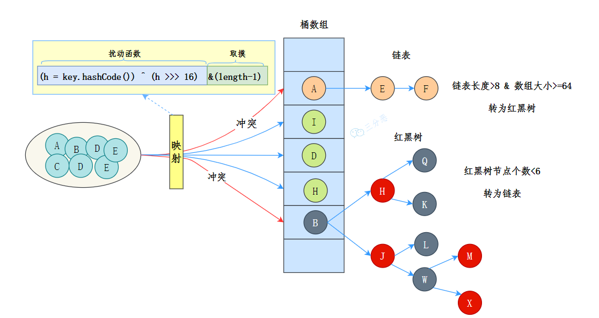
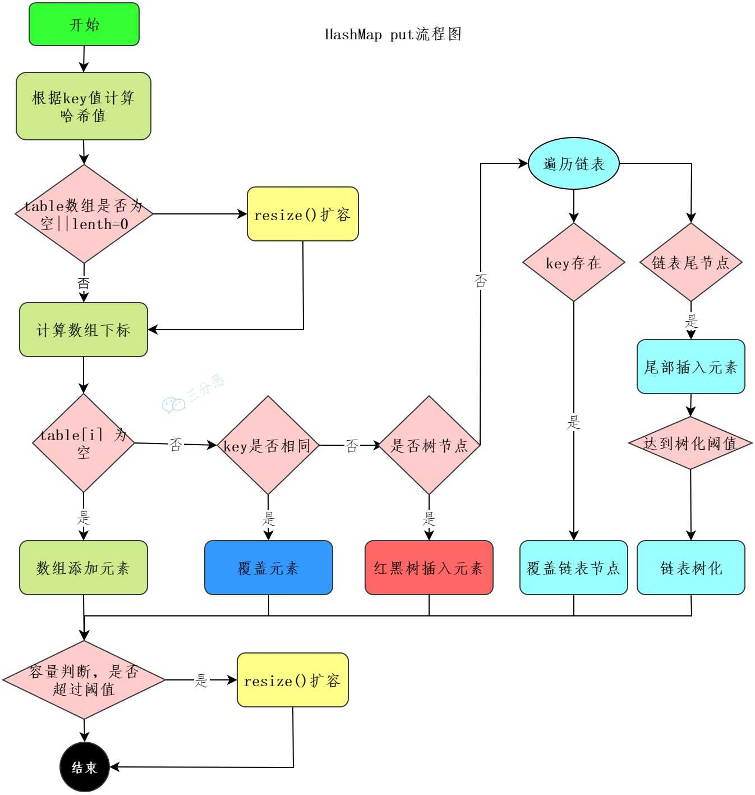

## 常见集合框架
①、Collection，主要由 List、Set、Queue 组成：

List 代表有序、可重复的集合，典型代表就是封装了动态数组的 ArrayList 和封装了链表的 LinkedList；
Set 代表无序、不可重复的集合，典型代表就是 HashSet 和 TreeSet；
Queue 代表队列，典型代表就是双端队列 ArrayDeque，以及优先级队列 PriorityQueue。

②、Map，代表键值对的集合，典型代表就是 HashMap。

Collection 接口：最基本的集合框架表示方式，提供了添加、删除、清空等基本操作，它主要有三个子接口：

集合框架位于 java.util 包下，该包含提供了两个常用的工具类：
- Collections：提供了一些对集合进行排序、二分查找、同步的静态方法。
- Arrays：提供了一些对数组进行排序、打印、和 List 进行转换的静态方法。

## 简单介绍一下队列 Queue
Java 中的队列主要通过 java.util.Queue 接口和 java.util.concurrent.BlockingQueue 两个接口来实现。

PriorityQueue 是一个基于优先级堆的无界队列，它的元素按照自然顺序排序或者 Comparator 进行排序。

ArrayDeque 是一个基于数组的双端队列，可以在两端插入和删除元素。

还有一个大家可能忽略的队列，那就是 LinkedList，它既可以当作 List 使用，也可以当作 Queue 使用。


## 用过哪些集合类，它们的优劣？
在 Java 中，常用的集合类有 ArrayList、LinkedList、HashMap、LinkedHashMap 等。

ArrayList：ArrayList 可以看作是一个动态数组，它可以在运行时动态扩容。优点是访问速度快，可以通过索引直接查到元素。缺点是插入和删除元素可能需要移动元素，效率就会降低。

LinkedList：LinkedList 是一个双向链表，它适合频繁的插入和删除操作。优点是插入和删除元素的时候只需要改变节点的前后指针，缺点是访问元素时需要遍历链表。

HashMap：HashMap 是一个基于哈希表的键值对集合。优点是插入、删除和查找元素的速度都很快。缺点是它不保留键值对的插入顺序。

LinkedHashMap：LinkedHashMap 在 HashMap 的基础上增加了一个双向链表来保持键值对的插入顺序。

## 队列和栈的区别了解吗？
队列是一种先进先出（FIFO, First-In-First-Out）的数据结构。在队列中，第一个加入队列的元素会是第一个被移除的。队列常用于处理按顺序来的任务。

栈是一种后进先出（LIFO, Last-In-First-Out）的数据结构。在这种结构中，最后一个加入栈的元素会是第一个被移除的。这种特性使得栈非常适合于那些需要访问最新添加的数据元素的场合。

## 哪些是线程安全的？
像 Vector、Hashtable、ConcurrentHashMap、CopyOnWriteArrayList、ConcurrentLinkedQueue、ArrayBlockingQueue、LinkedBlockingQueue 这些都是线程安全的。

## Java 集合用过哪些？Collection 继承了哪些接口？
最经常用的就是封装了动态数组的 ArrayList 和封装了链表的 LinkedList；以及键值对 HashMap。

Collection 继承了 Iterable 接口，这意味着所有实现 Collection 接口的类都必须实现 iterator() 方法，之后就可以使用增强型 for 循环遍历集合中的元素了。


## ArrayList 和 LinkedList 有什么区别？
ArrayList 和 LinkedList 的区别主要体现在数据结构、用途、是否支持随机访问、内存占用等方面。

### 数据结构有什么不同？
ArrayList 基于数组实现
LinkedList 基于链表实现

### 内存占用有何不同？
ArrayList 是基于数组的，是一块连续的内存空间，所以它的内存占用是比较紧凑的；但如果涉及到扩容，就会重新分配内存，空间是原来的 1.5 倍，存在一定的空间浪费。

LinkedList 是基于链表的，每个节点都有一个指向下一个节点和上一个节点的引用，于是每个节点占用的内存空间稍微大一点。

### 用途有什么不同？
多数情况下，ArrayList 更利于查找，LinkedList 更利于增删

①、由于 ArrayList 是基于数组实现的，所以 get(int index) 可以直接通过数组下标获取，时间复杂度是 O(1)；LinkedList 是基于链表实现的，get(int index) 需要遍历链表，时间复杂度是 O(n)。

当然，get(E element) 这种查找，两种集合都需要遍历通过 equals 比较获取元素，所以时间复杂度都是 O(n)。

②、ArrayList 如果增删的是数组的尾部，直接插入或者删除就可以了，时间复杂度是 O(1)；如果 add 的时候涉及到扩容，时间复杂度会提升到 O(n)。

但如果插入的是中间的位置，就需要把插入位置后的元素向前或者向后移动，甚至还有可能触发扩容，效率就会低很多，O(n)。

LinkedList 因为是链表结构，插入和删除只需要改变前置节点、后置节点和插入节点的引用就行了，不需要移动元素。

如果是在链表的头部插入或者删除，时间复杂度是 O(1)；如果是在链表的中间插入或者删除，时间复杂度是 O(n)，因为需要遍历链表找到插入位置；如果是在链表的尾部插入或者删除，时间复杂度是 O(1)。

注意，这里有个陷阱，LinkedList 更利于增删不是体现在时间复杂度上，因为二者增删的时间复杂度都是 O(n)，都需要遍历列表；而是体现在增删的效率上，因为 LinkedList 的增删只需要改变引用，而 ArrayList 的增删可能需要移动元素。


### 是否支持随机访问？
①、ArrayList 是基于数组的，也实现了 RandomAccess 接口，所以它支持随机访问，可以通过下标直接获取元素。

②、LinkedList 是基于链表的，所以它没法根据下标直接获取元素，不支持随机访问，所以它也没有实现 RandomAccess 接口。

### 使用场景有什么不同？
ArrayList 适用于：
随机访问频繁：需要频繁通过索引访问元素的场景。
读取操作远多于写入操作：如存储不经常改变的列表。
末尾添加元素：需要频繁在列表末尾添加元素的场景。 

LinkedList 适用于：
频繁插入和删除：在列表中间频繁插入和删除元素的场景。
不需要快速随机访问：顺序访问多于随机访问的场景。
队列和栈：由于其双向链表的特性，LinkedList 可以高效地实现队列（FIFO）和栈（LIFO）。

## ArrayList 的扩容机制了解吗？
ArrayList 确切地说，应该叫做动态数组，因为它的底层是通过数组来实现的，当往 ArrayList 中添加元素时，会先检查是否需要扩容，如果当前容量+1 超过数组长度，就会进行扩容。

扩容后的新数组长度是原来的 1.5 倍，然后再把原数组的值拷贝到新数组中。

## ArrayList 怎么序列化的知道吗？ 为什么用 transient 修饰数组？
ArrayList 的序列化不太一样，它使用transient修饰存储元素的elementData的数组，transient关键字的作用是让被修饰的成员属性不被序列化。

为什么最 ArrayList 不直接序列化元素数组呢？

出于效率的考虑，数组可能长度 100，但实际只用了 50，剩下的 50 不用其实不用序列化，这样可以提高序列化和反序列化的效率，还可以节省内存空间。

那 ArrayList 怎么序列化呢？

ArrayList 通过两个方法readObject、writeObject自定义序列化和反序列化策略，实际直接使用两个流ObjectOutputStream和ObjectInputStream来进行序列化和反序列化。

## 快速失败(fail-fast)和安全失败(fail-safe)了解吗？
快速失败（fail—fast）：快速失败是 Java 集合的一种错误检测机制

在用迭代器遍历一个集合对象时，如果线程 A 遍历过程中，线程 B 对集合对象的内容进行了修改（增加、删除、修改），则会抛出 Concurrent Modification Exception。    

原理：迭代器在遍历时直接访问集合中的内容，并且在遍历过程中使用一个 modCount 变量。集合在被遍历期间如果内容发生变化，就会改变modCount的值。每当迭代器使用 hashNext()/next()遍历下一个元素之前，都会检测 modCount 变量是否为 expectedmodCount 值，是的话就返回遍历；否则抛出异常，终止遍历。

注意：这里异常的抛出条件是检测到 modCount！=expectedmodCount 这个条件。如果集合发生变化时修改 modCount 值刚好又设置为了 expectedmodCount 值，则异常不会抛出。因此，不能依赖于这个异常是否抛出而进行并发操作的编程，这个异常只建议用于检测并发修改的 bug。   

场景：java.util 包下的集合类都是快速失败的，不能在多线程下发生并发修改（迭代过程中被修改），比如 ArrayList 类。

采用安全失败机制的集合容器，在遍历时不是直接在集合内容上访问的，而是先复制原有集合内容，在拷贝的集合上进行遍历。   

原理：由于迭代时是对原集合的拷贝进行遍历，所以在遍历过程中对原集合所作的修改并不能被迭代器检测到，所以不会触发 Concurrent Modification Exception。   

缺点：基于拷贝内容的优点是避免了 Concurrent Modification Exception，但同样地，迭代器并不能访问到修改后的内容，即：迭代器遍历的是开始遍历那一刻拿到的集合拷贝，在遍历期间原集合发生的修改迭代器是不知道的。

场景：java.util.concurrent 包下的容器都 是安全失败，可以在多线程下并发使用，并发修改，比如 CopyOnWriteArrayList 类。

## 有哪几种实现 ArrayList 线程安全的方法？
可以使用 Collections.synchronizedList() 方法，它将返回一个线程安全的 List。
```java
SynchronizedList list = Collections.synchronizedList(new ArrayList());
```
内部是通过 synchronized 关键字加锁来实现的。

也可以直接使用 CopyOnWriteArrayList，它是线程安全的，遵循写时复制的原则，每当对列表进行修改（例如添加、删除或更改元素）时，都会创建列表的一个新副本，这个新副本会替换旧的列表，而对旧列表的所有读取操作仍然可以继续。

```java
CopyOnWriteArrayList list = new CopyOnWriteArrayList();
```

通俗的讲，CopyOnWrite 就是当我们往一个容器添加元素的时候，不直接往容器中添加，而是先复制出一个新的容器，然后在新的容器里添加元素，添加完之后，再将原容器的引用指向新的容器。多个线程在读的时候，不需要加锁，因为当前容器不会添加任何元素。这样就实现了线程安全。


## ArrayList 和 Vector 的区别？
ArrayList 是在 JDK 1.2 时引入的，用于替代 Vector 作为主要的非同步动态数组实现。因为 Vector 所有的方法都使用 synchronized 关键字进行了同步，单线程环境下效率较低。

## CopyOnWriteArrayList 了解多少？
CopyOnWriteArrayList 就是线程安全版本的 ArrayList。

它的名字叫CopyOnWrite——写时复制，已经明示了它的原理。

CopyOnWriteArrayList 采用了一种读写分离的并发策略。CopyOnWriteArrayList 容器允许并发读，读操作是无锁的，性能较高。至于写操作，比如向容器中添加一个元素，则首先将当前容器复制一份，然后在新副本上执行写操作，结束之后再将原容器的引用指向新容器。


## 能说一下 HashMap 的底层数据结构吗？
JDK 8 中 HashMap 的数据结构是数组+链表+红黑树。



数组（Node[] table）用来存储键值对。数组中的每个元素被称为“桶”（Bucket），每个桶的索引通过对键的哈希值进行 hash() 处理得到。

当多个键经过哈希处理后得到相同的索引时，需要通过链表来解决哈希冲突——即将具有相同索引的键值对通过链表连接起来。

不过，链表过长时，查询效率会比较低，于是当链表的长度超过 8 时（且数组的长度大于 64），链表就会转换为红黑树。红黑树的查询效率是 O(logn)，比链表的 O(n) 要快。

hash() 的目标是尽量减少哈希冲突，保证元素能够均匀地分布在数组的每个位置上。

```java
static final int hash(Object key) {
    int h;
    return (key == null) ? 0 : (h = key.hashCode()) ^ (h >>> 16);
}
```

如果键已经存在，其对应的值将被新值覆盖。

当从 HashMap 中获取元素时，也会使用 hash() 计算键的位置，然后根据位置在数组查找元素。

HashMap 的初始容量是 16，随着元素的不断添加，HashMap 的容量可能不足，于是就需要进行扩容，阈值是capacity * loadFactor，capacity 为容量，loadFactor 为负载因子，默认为 0.75。

扩容后的数组大小是原来的 2 倍，然后把原来的元素重新计算哈希值，放到新的数组中，这一步也是 HashMap 最耗时的操作。

## 你对红黑树了解多少？为什么不用二叉树/平衡树呢？
红黑树是一种自平衡的二叉查找树：
1. 每个节点要么是红色，要么是黑色；
2. 根节点永远是黑色；
3. 所有的叶子节点都是是黑色的（下图中的 NULL 节点）；
4. 红色节点的子节点一定是黑色的；
5. 从任一节点到其每个叶子的所有简单路径都包含相同数目的黑色节点。

### 为什么不用二叉树？
二叉树是最基本的树结构，每个节点最多有两个子节点，但是二叉树容易出现极端情况，比如插入的数据是有序的，那么二叉树就会退化成链表，查询效率就会变成 O(n)。

### 为什么不用平衡二叉树？
平衡二叉树比红黑树的要求更高，每个节点的左右子树的高度最多相差 1，这种高度的平衡保证了极佳的查找效率，但在进行插入和删除操作时，可能需要频繁地进行旋转来维持树的平衡，这在某些情况下可能导致更高的维护成本。

红黑树是一种折中的方案，它在保证了树平衡的同时，插入和删除操作的性能也得到了保证，查询效率是 O(logn)。

## 红黑树怎么保持平衡的？
红黑树有两种方式保持平衡：旋转和染色。

①、旋转：旋转分为两种，左旋和右旋
②、染⾊

## HashMap 的 put 流程知道吗？


1. 通过 hash 方法计算 key 的哈希值。
2. 数组进行第一次扩容
3. 根据哈希值计算 key 在数组中的下标，如果对应下标正好没有存放数据，则直接插入。
4. 如果对应下标已经有数据了，就需要判断是否为相同的 key，是则覆盖 value，否则需要判断是否为树节点，是则向树中插入节点，否则向链表中插入数据。
5. 注意，在链表中插入节点的时候，如果链表长度大于等于 8，则需要把链表转换为红黑树。
6. 所有元素处理完后，还需要判断是否超过阈值threshold，超过则扩容。

### 只重写 equals 没重写 hashcode，map put 的时候会发生什么?
如果只重写 equals 方法，没有重写 hashcode 方法，那么会导致 equals 相等的两个对象，hashcode 不相等，这样的话，这两个对象会被放到不同的桶中，这样就会导致 get 的时候，找不到对应的值。

## HashMap 怎么查找元素的呢？
HashMap 的查找就简单很多：

- 使用扰动函数，获取新的哈希值
- 计算数组下标，获取节点
- 当前节点和 key 匹配，直接返回
- 否则，当前节点是否为树节点，查找红黑树
- 否则，遍历链表查找

## HashMap 的 hash 函数是怎么设计的?
HashMap 的哈希函数是先拿到 key 的 hashcode，是一个 32 位的 int 类型的数值，然后让 hashcode 的高 16 位和低 16 位进行异或操作。


static final int hash(Object key) {
    int h;
    // key的hashCode和key的hashCode右移16位做异或运算
    return (key == null) ? 0 : (h = key.hashCode()) ^ (h >>> 16);
}
这么设计是为了降低哈希碰撞的概率。

## 为什么 hash 函数能降哈希碰撞？
在 hash 函数中，先调用了 key 的hashCode() 方法，这将会返回一个 int 类型的哈希值，比如说字符串的 hashCode。

int 的范围是 -2147483648~2147483647，加起来大概 40 亿上下的浮动。

只要 key 的 hashCode 方法设计的比较合理，一般是很难出现碰撞的。但问题是，不可能直接搞一个 40 亿长度的数组啊，那也太铺张浪费了。

我们一般会设置一个较小的数组长度，比如说 HashMap 的数组初始大小才 16，当发现容量不满足的时候再扩容，避免浪费。

那当数组长度比较小的时候，我们就需要设计一种比较巧妙的 hash 算法，来避免发生哈希冲突，尽可能地让元素均匀地分布在数组当中。

要达到这个目的，HashMap 在两方面下足了功夫，第一个就是数组的长度必须是 2 的整数次幂，这样可以保证 hash & (n-1) 的结果能均匀地分布在数组中。

其作用就相当于 hash % n，n 为数组的长度，比如说数组长度是 16，hash 值为 20，那么 20 % 16 = 4，也就是说 20 这个元素应该放在数组的第 4 个位置；hash 值为 23，那么 23 % 16 = 7，也就是说 23 这个元素应该放在数组的第 7 个位置。

& 操作的结果就是哈希值的高位全部归零，只保留 n 个低位，用来做数组下标访问。

比如说 hash & ($2^{4} - 1$) 的结果实际上是取 hash 的低 4 位，这四位能表示的取值范围刚好是 0000 到 1111，也就是 0 到 15，正好是数组长度为 16 的下标范围。

以初始长度 16 为例，16-1=15。2 进制表示是0000 0000 0000 0000 0000 0000 0000 1111。和某个哈希值做 & 运算，结果就是截取了最低的四位。

将哈希值无符号右移 16 位，意味着原哈希值的高 16 位被移到了低 16 位的位置。这样，原始哈希值的高 16 位和低 16 位就可以参与到最终用于索引计算的低位中。

选择 16 位是因为它是 32 位整数的一半，这样处理既考虑了高位的信息，又没有完全忽视低位原本的信息，尝试达到一个平衡状态。

## 为什么 HashMap 的容量是 2 的倍数呢？
HashMap 的容量是 2 的倍数，或者说是 2 的整数次幂，是为了快速定位元素的下标：

HashMap 在定位元素位置时，先通过 hash(key) = (h = key.hashCode()) ^ (h >>> 16) 计算出哈希值，再通过 hash & (n-1) 来定位元素位置的，n 为数组的大小，也就是 HashMap 的容量。

因为（数组长度-1）正好相当于一个“低位掩码”——这个掩码的低位最好全是 1，这样 & 操作才有意义，否则结果就肯定是 0。

2 的整次幂（或者叫 2 的整数倍）刚好是偶数，偶数-1 是奇数，奇数的二进制最后一位是 1，保证了 hash &(length-1) 的最后一位可能为 0，也可能为 1（取决于 hash 的值），即 & 运算后的结果可能为偶数，也可能为奇数，这样便可以保证哈希值的均匀分布。

换句话说，& 操作的结果就是将哈希值的高位全部归零，只保留低位值。


## 如果初始化 HashMap，传一个 17 容量，它会怎么处理？
HashMap 会将这个值转换为大于或等于 17 的最小的 2 的幂。这是因为 HashMap 的设计是基于哈希表的，而哈希表的大小最好是 2 的幂，这样可以优化哈希值的计算，并减少哈希冲突。   

所以，如果你传入 17 作为初始容量，HashMap 实际上会被初始化为大小为 32 的哈希表。 

### 初始化 HashMap 的时候需要传入容量值吗？
在创建 HashMap 时可以指定初始容量值。这个容量是指 Map 内部用于存储数据的数组大小。

如果预先知道 Map 将存储大量键值对，提前指定一个足够大的初始容量可以减少因扩容导致的重哈希（rehashing）操作，从而提高性能。

因为每次扩容时，HashMap 需要新分配一个更大的数组并重新将现有的元素插入到这个新数组中，这个过程相对耗时，尤其是当 Map 中已有大量数据时。

当然了，过大的初始容量会浪费内存，特别是当实际存储的元素远少于初始容量时。如果不指定初始容量，HashMap 将使用默认的初始容量 16。


## 你还知道哪些哈希函数的构造方法呢？
HashMap 里哈希构造函数的方法叫：

- 除留取余法：H(key)=key%p(p<=N)，关键字除以一个不大于哈希表长度的正整数 p，所得余数为地址，当然 HashMap 里进行了优化改造，效率更高，散列也更均衡。  

除此之外，还有这几种常见的哈希函数构造方法：

- 直接定址法
直接根据key来映射到对应的数组位置，例如 1232 放到下标 1232 的位置。

- 数字分析法
取key的某些数字（例如十位和百位）作为映射的位置

- 平方取中法
取key平方的中间几位作为映射的位置

- 折叠法
将key分割成位数相同的几段，然后把它们的叠加和作为映射的位置


## 解决哈希冲突有哪些方法呢？


