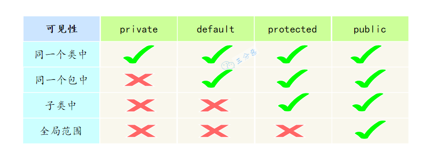
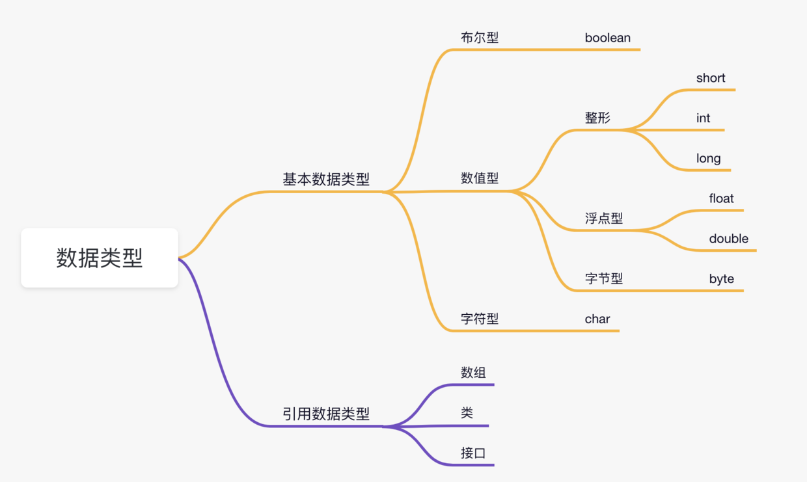
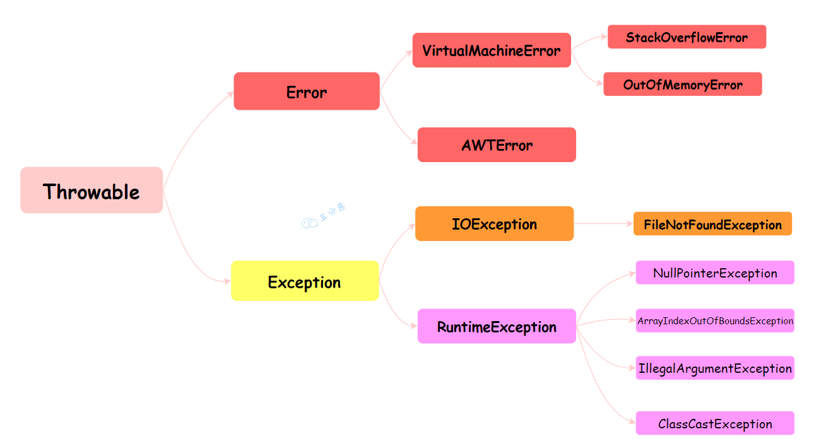
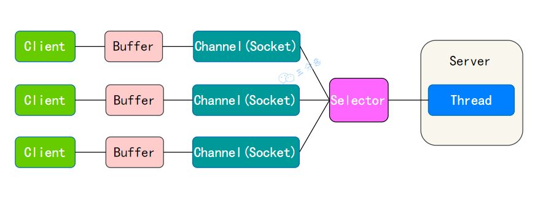

## JAVA语言特点
- 面向对象，主要是封装，继承，多态
- 平台无关性，JVM使得在不同平台上运行不需要重新编译
- 支持多线程
- 支持JIT编译，即时编译器，可以在程序运行时将字节码转换为本地机器码来提高程序运行速度

## JVM， JDK， JRE区别？
- JVM：Java 虚拟机，是 Java 实现跨平台的关键所在，针对不同的操作系统，有不同的 JVM 实现。JVM 负责将 Java 字节码转换为特定平台的机器码，并执行。
- JDK：Java SDK（软件开发工具包），包括了 JRE 以及编译器（javac）、Java 文档生成工具（Javadoc）、Java 调试器等开发工具。为开发者提供了开发、编译、调试 Java 程序的一整套环境。
- JRE： Java Runtime Environment，也就是 Java 运行时环境，包含了运行 Java 程序所必需的库，以及 Java 虚拟机（JVM）。

## 什么是字节码？采用字节码的好处是什么?
字节码，就是 Java 程序经过编译之类产生的.class 文件，字节码能够被虚拟机识别，从而实现 Java 程序的跨平台性。  
Java 程序从源代码到运行主要有三步：  
编译：将我们的代码（.java）编译成虚拟机可以识别理解的字节码(.class)  
解释：虚拟机执行 Java 字节码，将字节码翻译成机器能识别的机器码  
执行：对应的机器执行二进制机器码  

## 为什么说 Java 语言“编译与解释并存”？
Java 语言既具有编译型语言的特征，也具有解释型语言的特征，因为 Java 程序要经过先编译，后解释两个步骤，由 Java 编写的程序需要先经过编译步骤，生成字节码（\*.class 文件），这种字节码必须再经过 JVM，解释成操作系统能识别的机器码，在由操作系统执行。因此，我们可以认为 Java 语言编译与解释并存。

## Java 有哪些数据类型？
基本数据类型和引用数据类型。


基本数据类型:
- 数值型: 
    - 整数类型（byte、short、int、long）
    - 浮点类型（float、double）
- 字符型（char）
- 布尔型（boolean）

boolean 类型实际占用几个字节？   
这要依据具体的 JVM 实现细节，但是在 Java 虚拟机规范中，并没有明确规定 boolean 类型的大小，只是规定 boolean 类型只能取 true 或 false 两个值。

## 自动类型转换，强制转换
Java 所有的数值型变量可以相互转换，当把一个表数范围小的数值或变量直接赋给另一个表数范围大的变量时，可以进行自动类型转换；反之，需要强制转换。

float f=3.4对吗？不对，3.4是双精度类型，需要强制转换    
short s1 = 1; s1 = s1 + 1；对吗？ 不对，因为1是int类型，需要强转
short s1 = 1; s1 += 1;对吗？ 对，因为+=包含了隐藏的强转      

## 什么是自动拆箱/装箱？
装箱：将基本数据类型转换为包装类型（Byte、Short、Integer、Long、Float、Double、Character、Boolean）。
拆箱：将包装类型转换为基本数据类型。

## break ,continue ,return 的区别及作用？
break 跳出整个循环，不再执行循环(结束当前的循环体)
continue 跳出本次循环，继续执行下次循环(结束正在执行的循环 进入下一个循环条件)
return 程序返回，不再执行下面的代码(结束当前的方法 直接返回)

## 用最有效率的方法计算 2 乘以 8？
2 << 3。位运算，数字的二进制位左移三位相当于乘以 2 的三次方。8就是2的三次方。

## 讲一下数据准确性高是怎么保证的？
保证数据准确性有两种方案，一种使用 BigDecimal，一种将浮点数转换为整数 int 进行计算。
肯定不能使用 float 和 double 类型，它们无法避免浮点数运算中常见的精度问题，因为这些数据类型采用二进制浮点数来表示，无法准确地表示。   

在处理小额支付或计算时，通过转换为较小的货币单位（如分），这样不仅提高了运算速度，还保证了计算的准确性。

## ⾯向对象和⾯向过程的区别?
⾯向过程 ：面向过程就是分析出解决问题所需要的步骤，然后用函数把这些步骤一步一步实现，使用的时候再一个一个的一次调用就可以。   
⾯向对象 ：面向对象，把构成问题的事务分解成各个对象，而建立对象的目的也不是为了完成一个个步骤，而是为了描述某个事件在解决整个问题的过程所发生的行为。 目的是为了写出通用的代码，加强代码的重用，屏蔽差异性。

## 面向对象3大特征
面向对象编程有三大特性：封装、继承、多态。  
- 封装是指将数据（属性，或者叫字段）和操作数据的方法（行为）捆绑在一起，形成一个独立的对象（类的实例）。

- 继承允许一个类（子类）继承现有类（父类或者基类）的属性和方法。以提高代码的复用性，建立类之间的层次关系。

- 多态允许不同类的对象对同一消息做出响应，但表现出不同的行为（即方法的多样性）。多态其实是一种能力——同一个行为具有不同的表现形式；换句话说就是，执行一段代码，Java 在运行时能根据对象类型的不同产生不同的结果。

    多态的前置条件有三个： 子类继承父类、子类重写父类的方法、父类引用指向子类的对象

    ```JAVA
    //子类继承父类
    class Wangxiaoer extends Wanger {
        public void write() { // 子类重写父类方法
            System.out.println("记住仇恨，表明我们要奋发图强的心智");
        }

        public static void main(String[] args) {
            // 父类引用指向子类对象
            Wanger wanger = new Wangxiaoer();
            wanger.write();
        }
    }

    class Wanger {
        public void write() {
            System.out.println("沉默王二是沙雕");
        }
    }
    ```

## 为什么Java里面要多组合少继承？
继承适合描述“is-a”的关系，但继承容易导致类之间的强耦合，一旦父类发生改变，子类也要随之改变，违背了开闭原则（尽量不修改现有代码，而是添加新的代码来实现）。  

组合适合描述“has-a”或“can-do”的关系，通过在类中组合其他类，能够更灵活地扩展功能。组合避免了复杂的类继承体系，同时遵循了开闭原则和松耦合的设计原则。

```JAVA
// 形状接口
interface Shape {
    void draw();
}

// 颜色接口
interface Color {
    void applyColor();
}
```

## 多态解决了什么问题？（补充）
多态的目的是为了提高代码的灵活性和可扩展性，使得代码更容易维护和扩展。比如说动态绑定，允许在程序在运行时再确定调用的是子类还是父类的方法。  

```JAVA
//子类继承父类
public class Wangxiaoer extends Wanger {
    public void write() { // 子类覆盖父类方法
        System.out.println("记住仇恨，表明我们要奋发图强的心智");
    }

    public static void main(String[] args) {
        // 父类引用指向子类对象
        Wanger[] wangers = { new Wanger(), new Wangxiaoer() };

        for (Wanger wanger : wangers) {
            // 对象是王二的时候输出：勿忘国耻
            // 对象是王小二的时候输出：记住仇恨，表明我们要奋发图强的心智
            wanger.write();
        }
    }
}

class Wanger {
    public void write() {
        System.out.println("勿忘国耻");
    }
}
```
答案是在运行时根据对象的类型进行后期绑定，编译器在编译阶段并不知道对象的类型，但是 Java 的方法调用机制能找到正确的方法体，然后执行，得到正确的结果。

## 重载和重写的区别？
如果一个类有多个名字相同但参数个数不同的方法，我们通常称这些方法为方法重载（overload）。如果方法的功能是一样的，但参数不同，使用相同的名字可以提高程序的可读性。

如果子类具有和父类一样的方法（参数相同、返回类型相同、方法名相同，但方法体可能不同），我们称之为方法重写（override）。方法重写用于提供父类已经声明的方法的特殊实现，是实现多态的基础条件。  

方法重载发生在同一个类中，同名的方法如果有不同的参数（参数类型不同、参数个数不同或者二者都不同）。   

方法重写发生在子类与父类之间，要求子类与父类具有相同的返回类型，方法名和参数列表，并且不能比父类的方法声明更多的异常，遵守里氏代换原则。   

## 什么是里氏代换原则？
规定任何父类可以出现的地方，子类也一定可以出现。  
子类在扩展父类时，不应改变父类原有的行为。例如，如果有一个方法接受一个父类对象作为参数，那么传入该方法的任何子类对象也应该能正常工作。  

## SOLID原则
- 单一职责原则（Single Responsibility Principle, SRP），指一个类应该只有一个引起它变化的原因，即一个类只负责一项职责。这样做的目的是使类更加清晰，更容易理解和维护。
- 开闭原则（Open-Closed Principle, OCP），指软件实体应该对扩展开放，对修改关闭。这意味着一个类应该通过扩展来实现新的功能，而不是通过修改已有的代码来实现。
- 里氏代换原则，规定任何父类可以出现的地方，子类也一定可以出现。
- 接口隔离原则（Interface Segregation Principle, ISP），指客户端不应该依赖它不需要的接口。这意味着设计接口时应该尽量精简，不应该设计臃肿庞大的接口。
- 依赖倒置原则（Dependency Inversion Principle, DIP），指高层模块不应该依赖低层模块，二者都应该依赖其抽象；抽象不应该依赖细节，细节应该依赖抽象。这意味着设计时应该尽量依赖接口或抽象类，而不是实现类。

## 访问修饰符 public、private、protected、以及不写（默认）时的区别？
Java 中，可以使用访问控制符来保护对类、变量、方法和构造方法的访问。Java 支持 4 种不同的访问权限。

- default （即默认，什么也不写）: 在同一包内可见，不使用任何修饰符。可以修饰在类、接口、变量、方法。
- private : 在同一类内可见。可以修饰变量、方法。注意：不能修饰类（外部类）
- public : 对所有类可见。可以修饰类、接口、变量、方法
- protected : 对同一包内的类和所有子类可见。可以修饰变量、方法。注意：不能修饰类（外部类）。



## this 关键字有什么作用？
this 是自身的一个对象，代表对象本身，可以理解为：指向对象本身的一个指针。

this 的用法在 Java 中大体可以分为 3 种：

- 普通的直接引用，this 相当于是指向当前对象本身
- 形参与成员变量名字重名，用 this 来区分：
```java
public Person(String name,int age){
    this.name=name;
    this.age=age;
}
```
- 引用本类的构造方法

## 抽象类和接口有什么区别？
- 一个类只能继承一个抽象类；但一个类可以实现多个接口。
- 抽象类符合 is-a 的关系，而接口更像是 has-a 的关系
- 抽象类更多地是用来为多个相关的类提供一个共同的基础框架，包括状态的初始化，而接口则是定义一套行为标准，让不同的类可以实现同一接口，提供行为的多样化实现。
- 抽象类可以有构造方法, 接口不行
- 接口可以多继承，一个接口可以继承多个接口，使用逗号分隔。

## 抽象类和普通类的区别？
抽象类使用 abstract 关键字定义，不能被实例化，只能作为其他类的父类。普通类没有 abstract 关键字，可以直接实例化。

抽象类可以包含抽象方法和非抽象方法。抽象方法没有方法体，必须由子类实现。普通类智能包含非抽象方法。


## 成员变量与局部变量的区别有哪些？
1. 从语法形式上看：成员变量是属于类的，⽽局部变量是在⽅法中定义的变量或是⽅法的参数；成员变量可以被 public , private , static 等修饰符所修饰，⽽局部变量不能被访问控制修饰符及 static 所修饰；但是，成员变量和局部变量都能被 final 所修饰。
2. 从变量在内存中的存储⽅式来看：如果成员变量是使⽤ static 修饰的，那么这个成员变量是属于类的，如果没有使⽤ static 修饰，这个成员变量是属于实例的。对象存于堆内存，如果局部变量类型为基本数据类型，那么存储在栈内存，如果为引⽤数据类型，那存放的是指向堆内存对象的引⽤或者是指向常量池中的地址。
3. 从变量在内存中的⽣存时间上看：成员变量是对象的⼀部分，它随着对象的创建⽽存在，⽽局部变量随着⽅法的调⽤⽽⾃动消失。
4. 成员变量如果没有被赋初值：则会⾃动以类型的默认值⽽赋值（⼀种情况例外:被 final 修饰的成员变量也必须显式地赋值），⽽局部变量则不会⾃动赋值。

## 静态变量和实例变量的区别？静态方法、实例方法呢？
静态变量: 是被 static 修饰符修饰的变量，也称为类变量，它属于类，不属于类的任何一个对象，一个类不管创建多少个对象，静态变量在内存中有且仅有一个副本。静态变量可以实现让多个对象共享内存。

实例变量: 必须依存于某一实例，需要先创建对象然后通过对象才能访问到它。  

静态方法：static 修饰的方法，也被称为类方法。在外部调⽤静态⽅法时，可以使⽤"类名.⽅法名"的⽅式，也可以使⽤"对象名.⽅法名"的⽅式。静态方法里不能访问类的非静态成员变量和方法。

实例⽅法：依存于类的实例，需要使用"对象名.⽅法名"的⽅式调用；可以访问类的所有成员变量和方法。

## final 关键字有什么作用？
1. 当 final 修饰一个类时，表明这个类不能被继承。比如，String 类、Integer 类和其他包装类都是用 final 修饰的。
2. 当 final 修饰一个方法时，表明这个方法不能被重写（Override）。也就是说，如果一个类继承了某个类，并且想要改变父类中被 final 修饰的方法的行为，是不被允许的。
3. 当 final 修饰一个变量时，表明这个变量的值一旦被初始化就不能被修改。  
如果是基本数据类型的变量，其数值一旦在初始化之后就不能更改；如果是引用类型的变量，在对其初始化之后就不能再让其指向另一个对象。但是引用指向的对象内容可以改变。

## final、finally、finalize 的区别？
final 是一个修饰符，可以修饰类、方法和变量。当 final 修饰一个类时，表明这个类不能被继承；当 final 修饰一个方法时，表明这个方法不能被重写；当 final 修饰一个变量时，表明这个变量是个常量，一旦赋值后，就不能再被修改了。  

finally 是 Java 中异常处理的一部分，用来创建 try 块后面的 finally 块。无论 try 块中的代码是否抛出异常，finally 块中的代码总是会被执行。通常，finally 块被用来释放资源，如关闭文件、数据库连接等。   

finalize 是Object 类的一个方法，用于在垃圾回收器将对象从内存中清除出去之前做一些必要的清理工作。

## ==和 equals 的区别？
==：用于比较两个对象的引用，即它们是否指向同一个对象实例。
如果两个变量引用同一个对象实例，== 返回 true，否则返回 false。

对于基本数据类型（如 int, double, char 等），== 比较的是值是否相等。

equals() 方法：用于比较两个对象的内容是否相等。默认情况下，equals() 方法的行为与 == 相同，即比较对象引用。然而，equals() 方法通常被各种类重写。例如，String 类重写了 equals() 方法，以便它可以比较两个字符串的字符内容是否完全一样。  

```java
String a = new String("沉默王二");
String b = new String("沉默王二");

// 使用 == 比较
System.out.println(a == b); // 输出 false，因为 a 和 b 引用不同的对象

// 使用 equals() 比较
System.out.println(a.equals(b)); // 输出 true，因为 a 和 b 的内容相同
```

## hashCode 与 equals?
什么是 hashCode 方法？
hashCode() 方法的作⽤是获取哈希码，它会返回⼀个 int 整数，定义在 Object 类中， 是一个本地⽅法。
hashCode 方法主要用来获取对象的哈希码，哈希码是由对象的内存地址或者对象的属性计算出来的，它是⼀个 int 类型的整数，通常是不会重复的，因此可以用来作为键值对的建，以提高查询效率。

## 为什么重写 equals 时必须重写 hashCode ⽅法？
这主要是由于哈希码（hashCode）的本质和目的所决定的。

哈希码是通过哈希函数将对象中映射成一个整数值，其主要目的是在哈希表中快速定位对象的存储位置。

由于哈希函数将一个较大的输入域映射到一个较小的输出域，不同的输入值（即不同的对象）可能会产生相同的输出值（即相同的哈希码）。

这种情况被称为哈希冲突。当两个不相等的对象发生哈希冲突时，它们会有相同的 hashCode。

为了解决哈希冲突的问题，哈希表在处理键时，不仅会比较键对象的哈希码，还会使用 equals 方法来检查键对象是否真正相等。如果两个对象的哈希码相同，但通过 equals 方法比较结果为 false，那么这两个对象就不被视为相等。


## Java 是值传递，还是引用传递？
Java 是值传递，不是引用传递。

当一个对象被作为参数传递到方法中时，参数的值就是该对象的引用。引用的值是对象在堆中的地址。

对象是存储在堆中的，所以传递对象的时候，可以理解为把变量存储的对象地址给传递过去。

引用类型的变量存储的是对象的地址，而不是对象本身。因此，引用类型的变量在传递时，传递的是对象的地址，也就是说，传递的是引用的值。

## 说说深拷贝和浅拷贝的区别?
浅拷贝会创建一个新对象，但这个新对象的属性（字段）和原对象的属性完全相同。如果属性是基本数据类型，拷贝的是基本数据类型的值；如果属性是引用类型，拷贝的是引用地址，因此新旧对象共享同一个引用对象。

浅拷贝的实现方式为：实现 Cloneable 接口并重写 clone() 方法。
```java
class Person implements Cloneable {
    String name;
    int age;
    Address address;

    public Person(String name, int age, Address address) {
        this.name = name;
        this.age = age;
        this.address = address;
    }

    @Override
    protected Object clone() throws CloneNotSupportedException {
        return super.clone();
    }
}

class Address {
    String city;

    public Address(String city) {
        this.city = city;
    }
}

public class Main {
    public static void main(String[] args) throws CloneNotSupportedException {
        Address address = new Address("河南省洛阳市");
        Person person1 = new Person("沉默王二", 18, address);
        Person person2 = (Person) person1.clone();

        System.out.println(person1.address == person2.address); // true
    }
}
```

深拷贝也会创建一个新对象，但会递归地复制所有的引用对象，确保新对象和原对象完全独立。新对象与原对象的任何更改都不会相互影响。

深拷贝的实现方式有：手动复制所有的引用对象，或者使用序列化与反序列化。
```JAVA
import java.io.*;

class Person implements Serializable {
    String name;
    int age;
    Address address;

    public Person(String name, int age, Address address) {
        this.name = name;
        this.age = age;
        this.address = address;
    }

    public Person deepClone() throws IOException, ClassNotFoundException {
        ByteArrayOutputStream bos = new ByteArrayOutputStream();
        ObjectOutputStream oos = new ObjectOutputStream(bos);
        oos.writeObject(this);

        ByteArrayInputStream bis = new ByteArrayInputStream(bos.toByteArray());
        ObjectInputStream ois = new ObjectInputStream(bis);
        return (Person) ois.readObject();
    }
}

class Address implements Serializable {
    String city;

    public Address(String city) {
        this.city = city;
    }
}

public class Main {
    public static void main(String[] args) throws IOException, ClassNotFoundException {
        Address address = new Address("河南省洛阳市");
        Person person1 = new Person("沉默王二", 18, address);
        Person person2 = person1.deepClone();

        System.out.println(person1.address == person2.address); // false
    }
}
```

## Java 创建对象有哪几种方式？
Java 有四种创建对象的方式：
1. new 关键字创建，这是最常见和直接的方式，通过调用类的构造方法来创建对象。
```java
Person person = new Person();
```
2. 反射机制创建，反射机制允许在运行时创建对象，并且可以访问类的私有成员，在框架和工具类中比较常见。
```java
Class clazz = Class.forName("Person");
Person person = (Person) clazz.newInstance();
```
3. clone 拷贝创建，通过 clone 方法创建对象，需要实现 Cloneable 接口并重写 clone 方法。
```java
Person person = new Person();
Person person2 = (Person) person.clone();
```
4. 序列化机制创建，通过序列化将对象转换为字节流，再通过反序列化从字节流中恢复对象。需要实现 Serializable 接口。
```JAVA
Person person = new Person();
ObjectOutputStream oos = new ObjectOutputStream(new FileOutputStream("person.txt"));
oos.writeObject(person);
ObjectInputStream ois = new ObjectInputStream(new FileInputStream("person.txt"));
Person person2 = (Person) ois.readObject();
```


## new 子类的时候，子类和父类静态代码块，构造方法的执行顺序
在 Java 中，当创建一个子类对象时，子类和父类的静态代码块、构造方法的执行顺序遵循一定的规则。这些规则主要包括以下几个步骤：

1. 首先执行父类的静态代码块（仅在类第一次加载时执行）。
2. 接着执行子类的静态代码块（仅在类第一次加载时执行）。
3. 再执行父类的构造方法。
4. 最后执行子类的构造方法。

静态代码块：在类加载时执行，仅执行一次，按父类-子类的顺序执行。
构造方法：在每次创建对象时执行，按父类-子类的顺序执行，先初始化块后构造方法。


## String 和 StringBuilder、StringBuffer 的区别？
String、StringBuilder和StringBuffer在 Java 中都是用于处理字符串的，它们之间的区别是，String 是不可变的，平常开发用得最多，当遇到大量字符串连接时，就用 StringBuilder，它不会生成很多新的对象，StringBuffer 和 StringBuilder 类似，但每个方法上都加了 synchronized 关键字，所以是线程安全的。

- String类的对象是不可变的。也就是说，一旦一个String对象被创建，它所包含的字符串内容是不可改变的。
- 每次对String对象进行修改操作（如拼接、替换等）实际上都会生成一个新的String对象，而不是修改原有对象。这可能会导致内存和性能开销，尤其是在大量字符串操作的情况下。

- StringBuilder提供了一系列的方法来进行字符串的增删改查操作，这些操作都是直接在原有字符串对象的底层数组上进行的，而不是生成新的 String 对象。
- StringBuilder不是线程安全的。这意味着在没有外部同步的情况下，它不适用于多线程环境。
- 相比于String，在进行频繁的字符串修改操作时，StringBuilder能提供更好的性能。 Java 中的字符串连+操作其实就是通过StringBuilder实现的。

- StringBuffer和StringBuilder类似，但StringBuffer是线程安全的，方法前面都加了synchronized关键字。

String：适用于字符串内容不会改变的场景，比如说作为 HashMap 的 key。   
StringBuilder：适用于单线程环境下需要频繁修改字符串内容的场景，比如在循环中拼接或修改字符串，是 String 的完美替代品。   
StringBuffer：现在已经不怎么用了，因为一般不会在多线程场景下去频繁的修改字符串内容。  

## String str1 = new String("abc") 和 String str2 = "abc" 的区别？
直接使用双引号为字符串变量赋值时，Java 首先会检查字符串常量池中是否已经存在相同内容的字符串。

如果存在，Java 就会让新的变量引用池中的那个字符串；如果不存在，它会创建一个新的字符串，放入池中，并让变量引用它。

使用 new String("abc") 的方式创建字符串时，实际分为两步：

第一步，先检查字符串字面量 "abc" 是否在字符串常量池中，如果没有则创建一个；如果已经存在，则引用它。   
第二步，在堆中再创建一个新的字符串对象，并将其初始化为字符串常量池中 "abc" 的一个副本。   


```java
String s1 = "沉默王二";
String s2 = "沉默王二";
String s3 = new String("沉默王二");

System.out.println(s1 == s2); // 输出 true，因为 s1 和 s2 引用的是字符串常量池中同一个对象。
System.out.println(s1 == s3); // 输出 false，因为 s3 是通过 new 关键字显式创建的，指向堆上不同的对象。
```

## String 是不可变类吗？字符串拼接是如何实现的？
String 是不可变的，这意味着一旦一个 String 对象被创建，其存储的文本内容就不能被改变。这是因为：


不可变性使得 String 对象在使用中更加安全。因为字符串经常用作参数传递给其他 Java 方法，例如网络连接、打开文件等。

如果 String 是可变的，这些方法调用的参数值就可能在不知不觉中被改变，从而导致网络连接被篡改、文件被莫名其妙地修改等问题。

②、不可变的对象因为状态不会改变，所以更容易进行缓存和重用。字符串常量池的出现正是基于这个原因。

当代码中出现相同的字符串字面量时，JVM 会确保所有的引用都指向常量池中的同一个对象，从而节约内存。

③、因为 String 的内容不会改变，所以它的哈希值也就固定不变。这使得 String 对象特别适合作为 HashMap 或 HashSet 等集合的键，因为计算哈希值只需要进行一次，提高了哈希表操作的效率。

## 字符串拼接是如何实现的？
因为 String 是不可变的，因此通过“+”操作符进行的字符串拼接，会生成新的字符串对象。

Java 8 时，JDK 对“+”号的字符串拼接进行了优化，Java 会在编译期基于 StringBuilder 的 append 方法进行拼接。

## 如何保证 String 不可变？
- String 类内部使用一个私有的字符数组来存储字符串数据。这个字符数组在创建字符串时被初始化，之后不允许被改变。
- String 类没有提供任何可以修改其内容的公共方法，像 concat 这些看似修改字符串的操作，实际上都是返回一个新创建的字符串对象，而原始字符串对象保持不变。
- String 类本身被声明为 final，这意味着它不能被继承。这防止了子类可能通过添加修改方法来改变字符串内容的可能性。

## intern 方法有什么作用？
如果当前字符串内容存在于字符串常量池（即 equals()方法为 true，也就是内容一样），直接返回字符串常量池中的字符串
否则，将此 String 对象添加到池中，并返回 String 对象的引用


## Integer a= 127，Integer b = 127；Integer c= 128，Integer d = 128；相等吗?
a 和 b 相等，c 和 d 不相等。

这个问题涉及到 Java 的自动装箱机制以及Integer类的缓存机制。

a和b是相等的。这是因为 Java 在自动装箱过程中，会使用Integer.valueOf()方法来创建Integer对象。

Integer.valueOf()方法会针对数值在-128 到 127 之间的Integer对象使用缓存。因此，a和b实际上引用了常量池中相同的Integer对象。

c和d不相等。这是因为 128 超出了Integer缓存的范围(-128 到 127)。

因此，自动装箱过程会为c和d创建两个不同的Integer对象，它们有不同的引用地址。

可以通过==运算符来检查它们是否相等，要比较Integer对象的数值是否相等，应该使用equals方法，而不是==运算符。


## 什么是 Integer 缓存？
大部分的数据操作都集中在值比较小的范围，因此 Integer 搞了个缓存池，默认范围是 -128 到 127。

当我们使用自动装箱来创建这个范围内的 Integer 对象时，Java 会直接从缓存中返回一个已存在的对象，而不是每次都创建一个新的对象。这意味着，对于这个值范围内的所有 Integer 对象，它们实际上是引用相同的对象实例。

Integer 缓存的主要目的是优化性能和内存使用。对于小整数的频繁操作，使用缓存可以显著减少对象创建的数量。

可以在运行的时候添加 -Djava.lang.Integer.IntegerCache.high=1000 来调整缓存池的最大值。

引用是 Integer 类型，= 右侧是 int 基本类型时，会进行自动装箱，调用的其实是 Integer.valueOf()方法，它会调用 IntegerCache。

```java
public static Integer valueOf(int i) {
    if (i >= IntegerCache.low && i <= IntegerCache.high)
        return IntegerCache.cache[i + (-IntegerCache.low)];
    return new Integer(i);
}

```

## new Integer(10) == new Integer(10) 相等吗
在 Java 中，使用new Integer(10) == new Integer(10)进行比较时，结果是 false。

这是因为 new 关键字会在堆（Heap）上为每个 Integer 对象分配新的内存空间，所以这里创建了两个不同的 Integer 对象，它们有不同的内存地址。

当使用==运算符比较这两个对象时，实际上比较的是它们的内存地址，而不是它们的值，因此即使两个对象代表相同的数值（10），结果也是 false。

## String 怎么转成 Integer 的？原理？
String 转成 Integer，主要有两个方法：

- Integer.parseInt(String s)
- Integer.valueOf(String s)

不管哪一种，最终还是会调用 Integer 类内中的parseInt(String s, int radix)方法。

## Object 类的常见方法？
在 Java 中，经常提到一个词“万物皆对象”，其中的“万物”指的是 Java 中的所有类，而这些类都是 Object 类的子类。

对象比较：
①、public native int hashCode() ：native 方法，用于返回对象的哈希码。

如果重写了 equals 方法，就应该重写 hashCode 方法。

②、public boolean equals(Object obj)：用于比较 2 个对象的内存地址是否相等。

对象拷贝：
protected native Object clone() throws CloneNotSupportedException：naitive 方法，返回此对象的一个副本。默认实现只做浅拷贝，且类必须实现 Cloneable 接口。

Object 本身没有实现 Cloneable 接口，所以在不重写 clone 方法的情况下直接直接调用该方法会发生 CloneNotSupportedException 异常。

对象转字符串：
public String toString()：返回对象的字符串表示。默认实现返回类名@哈希码的十六进制表示，但通常会被重写以返回更有意义的信息。 


## Java 中异常处理体系?
Java 中的异常处理机制用于处理程序运行过程中可能发生的各种异常情况，通常通过 try-catch-finally 语句和 throw 关键字来实现。




Throwable 是 Java 语言中所有错误和异常的基类。它有两个主要的子类：Error 和 Exception，这两个类分别代表了 Java 异常处理体系中的两个分支。

Error 类代表那些严重的错误，这类错误通常是程序无法处理的。比如，OutOfMemoryError 表示内存不足，StackOverflowError 表示栈溢出。这些错误通常与 JVM 的运行状态有关，一旦发生，应用程序通常无法恢复。

Exception 类代表程序可以处理的异常。它分为两大类：编译时异常（Checked Exception）和运行时异常（Runtime Exception）。

①、编译时异常（Checked Exception）：这类异常在编译时必须被显式处理（捕获或声明抛出）。

如果方法可能抛出某种编译时异常，但没有捕获它（try-catch）或没有在方法声明中用 throws 子句声明它，那么编译将不会通过。例如：IOException、SQLException 等。

②、运行时异常（Runtime Exception）：这类异常在运行时抛出，它们都是 RuntimeException 的子类。对于运行时异常，Java 编译器不要求必须处理它们（即不需要捕获也不需要声明抛出）。

运行时异常通常是由程序逻辑错误导致的，如 NullPointerException、IndexOutOfBoundsException 等。

## 异常的处理方式？
①、遇到异常时可以不处理，直接通过throw 和 throws 抛出异常，交给上层调用者处理。

throws 关键字用于声明可能会抛出的异常，而 throw 关键字用于抛出异常。

```java
public void test() throws Exception {
    throw new Exception("抛出异常");
}
```

②、使用 try-catch 捕获异常，处理异常。
```java
try {
    //包含可能会出现异常的代码以及声明异常的方法
}catch(Exception e) {
    //捕获异常并进行处理
}finally {
    //可选，必执行的代码
}
```


## Java 中 IO 流分为几种?
- 输入流（Input Stream）：从源（如文件、网络等）读取数据到程序。
- 输出流（Output Stream）：将数据从程序写出到目的地（如文件、网络、控制台等）。
按处理数据单位如何划分？
- 字节流（Byte Streams）：以字节为单位读写数据，主要用于处理二进制数据，如音频、图像文件等。
- 字符流（Character Streams）：以字符为单位读写数据，主要用于处理文本数据。
- 节点流（Node Streams）：直接与数据源或目的地相连，如 FileInputStream、FileOutputStream。
- 处理流（Processing Streams）：对一个已存在的流进行包装，如缓冲流 BufferedInputStream、BufferedOutputStream。
- 管道流（Piped Streams）：用于线程之间的数据传输，如 PipedInputStream、PipedOutputStream。

## Java 缓冲区溢出，如何预防
①、合理设置缓冲区大小：在创建缓冲区时，应根据实际需求合理设置缓冲区的大小，避免创建过大或过小的缓冲区。

②、控制写入数据量：在向缓冲区写入数据时，应该控制写入的数据量，确保不会超过缓冲区的容量。Java 的 ByteBuffer 类提供了remaining()方法，可以获取缓冲区中剩余的可写入数据量。

## 既然有了字节流,为什么还要有字符流?
无论是文本文件还是视频文件，它们在物理存储层面都是以字节流的形式存在。区别在于，我们如何通过 Java 代码来解释和处理这些字节流：作为编码后的字符还是作为二进制数据。

## BIO、NIO、AIO 之间的区别？
BIO（Blocking I/O）：采用阻塞式 I/O 模型，线程在执行 I/O 操作时被阻塞，无法处理其他任务，适用于连接数较少的场景。

NIO（New I/O 或 Non-blocking I/O）：采用非阻塞 I/O 模型，线程在等待 I/O 时可执行其他任务，通过 Selector 监控多个 Channel 上的事件，适用于连接数多但连接时间短的场景。

AIO（Asynchronous I/O）：使用异步 I/O 模型，线程发起 I/O 请求后立即返回，当 I/O 操作完成时通过回调函数通知线程，适用于连接数多且连接时间长的场景。

NIO 的魅力主要体现在网络编程中，服务器可以用一个线程处理多个客户端连接，通过 Selector 监听多个 Channel 来实现多路复用，极大地提高了网络编程的性能。缓冲区 Buffer 也能极大提升一次 IO 操作的效率。


## 什么是序列化？什么是反序列化？
序列化（Serialization）是指将对象转换为字节流的过程，以便能够将该对象保存到文件、数据库，或者进行网络传输。

反序列化（Deserialization）就是将字节流转换回对象的过程，以便构建原始对象。


## serialVersionUID 有什么用？
serialVersionUID 是 Java 序列化机制中用于标识类版本的唯一标识符。它的作用是确保在序列化和反序列化过程中，类的版本是兼容的。

```java
import java.io.Serializable;

public class MyClass implements Serializable {
    private static final long serialVersionUID = 1L;
    private String name;
    private int age;

    // getters and setters
}
```
serialVersionUID 被设置为 1L 是一种比较省事的做法，也可以使用 Intellij IDEA 进行自动生成。

但只要 serialVersionUID 在序列化和反序列化过程中保持一致，就不会出现问题。

如果不显式声明 serialVersionUID，Java 运行时会根据类的详细信息自动生成一个 serialVersionUID。那么当类的结构发生变化时，自动生成的 serialVersionUID 就会发生变化，导致反序列化失败。

## Java 序列化不包含静态变量吗？
是的，序列化机制只会保存对象的状态，而静态变量属于类的状态，不属于对象的状态。

## 如果有些变量不想序列化，怎么办？
可以使用transient关键字修饰不想序列化的变量。
```java
public class Person implements Serializable {
    private String name;
    private transient int age;
    // 省略 getter 和 setter 方法
}
```

## 能解释一下序列化的过程和作用吗？
序列化过程通常涉及到以下几个步骤：

第一步，实现 Serializable 接口。
```java
public class Person implements Serializable {
    private String name;
    private int age;

    // 省略构造方法、getters和setters
}
```
第二步，使用 ObjectOutputStream 来将对象写入到输出流中。
```java
ObjectOutputStream out = new ObjectOutputStream(new FileOutputStream("person.ser"));
```

第三步，调用 ObjectOutputStream 的 writeObject 方法，将对象序列化并写入到输出流中。
```java
Person person = new Person("沉默王二", 18);
out.writeObject(person);
```

## 说说有几种序列化方式？
- Java 对象序列化 ：Java 原生序列化方法即通过 Java 原生流(InputStream 和 OutputStream 之间的转化)的方式进行转化，一般是对象输出流 ObjectOutputStream和对象输入流ObjectInputStream。
- Json 序列化：这个可能是我们最常用的序列化方式，Json 序列化的选择很多，一般会使用 jackson 包，通过 ObjectMapper 类来进行一些操作，比如将对象转化为 byte 数组或者将 json 串转化为对象。
- ProtoBuff 序列化：ProtocolBuffer 是一种轻便高效的结构化数据存储格式，ProtoBuff 序列化对象可以很大程度上将其压缩，可以大大减少数据传输大小，提高系统性能。

## 说一下你对注解的理解？
Java 注解本质上是一个标记。  

注解可以标记在类上、方法上、属性上等，标记自身也可以设置一些值，比如帽子颜色是绿色。

有了标记之后，我们就可以在编译或者运行阶段去识别这些标记，然后搞一些事情，这就是注解的用处。


## 什么是反射？应用？原理？
反射允许 Java 在运行时检查和操作类的方法和字段。通过反射，可以动态地获取类的字段、方法、构造方法等信息，并在运行时调用方法或访问字段。

## 反射的原理是什么？
Java 程序的执行分为编译和运行两步，编译之后会生成字节码(.class)文件，JVM 进行类加载的时候，会加载字节码文件，将类型相关的所有信息加载进方法区，反射就是去获取这些信息，然后进行各种操作。

## Stream 流用过吗？
Stream 流，简单来说，使用 java.util.Stream 对一个包含一个或多个元素的集合做各种操作。这些操作可能是 中间操作 亦或是 终端操作。 终端操作会返回一个结果，而中间操作会返回一个 Stream 流。

## JDK 1.8 都有哪些新特性？
Lambda 表达式、接口默认方法、Stream API、日期时间 API、Optional 类等。


